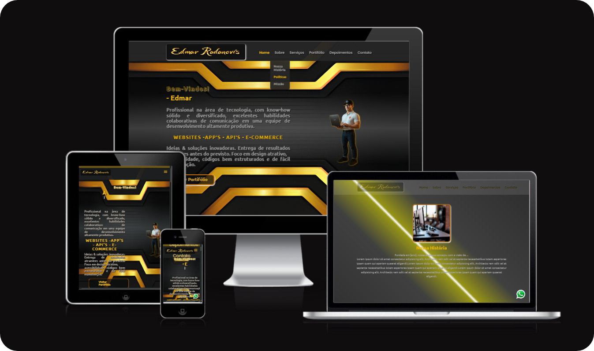
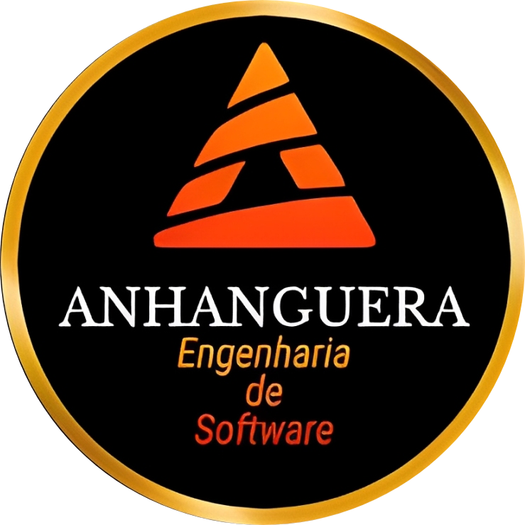

# Projeto - Atividade Prática: Construção de Front-End Baseado em Framework

## Disciplina: Desenvolvimento Responsivo

### Unidade 3 – Aula 2

Ministrado por _Profº Me. Anderson Emidio de Macedo Gonçalves_.
<br>

Abaixo segue o resultado do projeto concluído:

> <br>
> 🎯 Objetivo:
>
> - Desenvolvi este mini aplicativo front-end, **_`"Menu Responsivo"`_**, como parte do curso de _Desenvolvimento Responsivo_ (Unidade U3, Aula A2). O projeto foca na criação de um menu de navegação responsivo e interativo usando apenas **_[HTML](https://developer.mozilla.org/en-US/docs/Web/HTML)_**, **_[CSS](https://developer.mozilla.org/en-US/docs/Web/CSS)_** e **_[JavaScript](https://developer.mozilla.org/en-US/docs/Web/JavaScript)_**. O menu se adapta perfeitamente a vários tamanhos de tela — smartphones, tablets (retrato e paisagem), Full HD (1920px+) e 4K (3840px+) com recursos como um botão de alternância (hambúrguer), submenus suspensos, animações suaves e melhorias de acessibilidade. ✅

> - Este projeto aprimorou minhas habilidades em design responsivo usando _media queries_ em CSS, manipulação do DOM com JavaScript e a implementação de elementos interativos para aumentar a usabilidade e a acessibilidade. Aproveitando o HTML semântico e técnicas modernas de CSS, aprimorei minha capacidade de criar layouts que funcionam de forma eficiente em diversos dispositivos, um diferencial importante no cenário atual de desenvolvimento web. ✅
>   > - A abordagem leve, combinada com a orientação prática do curso, tornou esta uma experiência gratificante e educativa, reforçando meu compromisso em entregar soluções web otimizadas e de alta qualidade.

<br>

### 🧩 Features

- Criar um menu de navegação responsivo que se adapte a smartphones, tablets (retrato e paisagem), telas Full HD (1920px+) e 4K (3840px+)
- Implementar um botão de alternância (tipo hambúrguer) para dispositivos móveis
- Exibir submenus suspensos com animações suaves
- Destacar o item de menu selecionado
- Garantir o fechamento automático de outros submenus ao abrir um novo
- Fornecer uma interface acessível e amigável com HTML semântico

---

<p align="center">

</p>

<div align="center">

Clique aqui para testar... obrigado pelo seu interesse!
( 🖱️ Ctrl + clique para abrir em uma nova aba ou visite [www.??????](https://www.??????) ).

</div>

 <p align="center">

</p>

---

### ✨ Ajustes e melhorias

O proposta da atividade foi totalmente concluída, o que Inclui a HomePage e AboutPage.

> 📝 Nota: As demais pages não foram criadas por questões de gestão de tempo, e serão criadas posteriormente.

---

### 🛠️ Tecnologias Utilizadas

- [x] **Frontend**:&nbsp;&nbsp;&nbsp;&nbsp;&nbsp;&nbsp;[](https://developer.mozilla.org/en-US/docs/Web/HTML) &nbsp;&nbsp;[](https://developer.mozilla.org/en-US/docs/Web/CSS)&nbsp;&nbsp;[](https://developer.mozilla.org/en-US/docs/Web/JavaScript)
      <br>

- [x] **Ferramentas de Desenvolvimento e Testes**:&nbsp;&nbsp;&nbsp;[](https://marketplace.visualstudio.com/items?itemName=ritwickdey.LiveServer)&nbsp;&nbsp;`Manual testing with Browser DevTools`
      <br>

- [x] **Hospedagem e Implantação**:&nbsp;&nbsp;&nbsp;&nbsp;&nbsp;&nbsp;[](https://pages.github.com/)
      <br>

- [x] **Planejamento e Edição**:&nbsp;&nbsp;&nbsp;&nbsp;&nbsp;&nbsp;[](https://figma.com/)&nbsp;&nbsp;[](https://code.visualstudio.com/)
      <br>

#### ⚙️ Steps for the project

✔️ - Planning: The project was structured with a focus on a functional mini app, **avoiding complex dependencies**, while prioritizing a clean, **maintainable** codebase.<br>
✔️ - Configure the environment:

- [ ] If you choose, clone the repository:

```bash
git clone https://github.com/ed-radanovis/Eng_Software_U3-A2_05-2025.git
```

- [ ] Navigate to the project folder: `cd Eng_Software_U3-A2_05-2025` or the folder you created and named.

---

#### 🖥️ Frontend

✔️ - Navigate to the root of the project: where ` index.html, src/css/, src/js/,` and `src/images/ ` are located.<br>
✔️ - Make sure the dependencies are available:

- [x] &nbsp;&nbsp;&nbsp;Download external libraries like `typed.js` , ` jquery` , `jquery-easing` , `ionicons` as linked in the `<head> ` of index.html.
- [x] &nbsp;&nbsp;&nbsp;Make sure the src/images/ folder contains the required resources (e.g. background.png, logo.png, mascot.png, etc).

✔️ - Open the `index.html` file directly in the browser or host it via `GitHub Pages`. <br>

---

#### 🌐 Deployment

✔️ - Hosting on GitHub Pages (free tier):

- [x] &nbsp;&nbsp;&nbsp; Go to [GitHub](https://github.com).
- [x] &nbsp;&nbsp;&nbsp; Navigate to your repository (e.g., `https://github.com/repository-created-by-you`).
- [x] &nbsp;&nbsp;&nbsp; Enable GitHub Pages: Go to the repository settings, scroll to the **_`"Pages"`_** section, select the branch (e.g., `main` or `gh-pages`), and set the root directory to `/` (project root).
- [x] &nbsp;&nbsp;&nbsp; Deploy and access the generated URL (e.g., `https://your-username.github.io/repository-name/`).

✔️ - Optional Hosting on Render (free tier):

- [ ] &nbsp;&nbsp;&nbsp; Go to [Render](https://render.com).
- [ ] &nbsp;&nbsp;&nbsp; Create a new Static Site, connect the repository `https://github.com/repository-created-by-you`.
- [ ] &nbsp;&nbsp;&nbsp; Set the root directory to `/` (project root).
- [ ] &nbsp;&nbsp;&nbsp; Deploy and access the generated URL (e.g., `https://your-app-name.onrender.com`).

---

#### 🔬 Testing

✔️ - Manual Testing:

- [x] &nbsp;&nbsp;&nbsp; Check the responsive behavior with DevTools (F12 > Toggle Device Toolbar) or another tool of your choice, to simulate across smartphones (max-width: 885px), tablets (886px-1024px), Full HD (1920px+), and 4K (3840px+) screens.
- [x] &nbsp;&nbsp;&nbsp; Test the hamburger toggle and submenu interactions on mobile devices.
- [x] &nbsp;&nbsp;&nbsp;Verify accessibility features (e.g. semantic tags, keyboard navigation, NonVisual Desktop Access (NVDA)) using Browser DevTools, ensuring compatibility and usability.

---

#### 📜 License

This project is licensed under the [MIT License](LICENSE).

---

<h4 align="center">
  👨‍💻 Developed by 
<h4/>
<br>
<table align="center"
  <tr>
    <td align="center">
      <a href="https://www.linkedin.com/in/edmar-radanovis-0130b611a/">
        <br>
      <sub>
        <b>Edmar Radanovis</b>
      </sub>
      </a>
    </td>
    <td align="center">
      <a href="https://www.anhanguera.com/">
        <br>
      <sub>
        <b>Undergraduate in<br>Software Engineering</b>
      </sub>
      </a>
    </td>
</table>
<br>
<br>

[⬆ Voltar ao topo](#projeto---atividade-prática-construção-de-front--end-baseado-em-framework)
