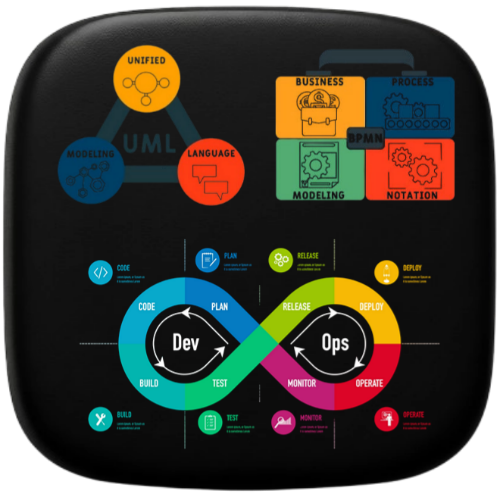
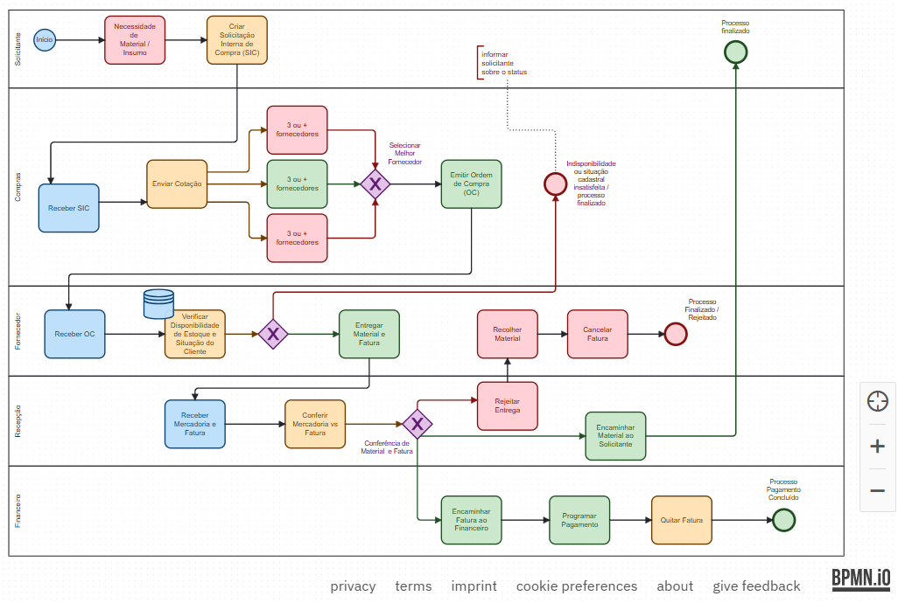
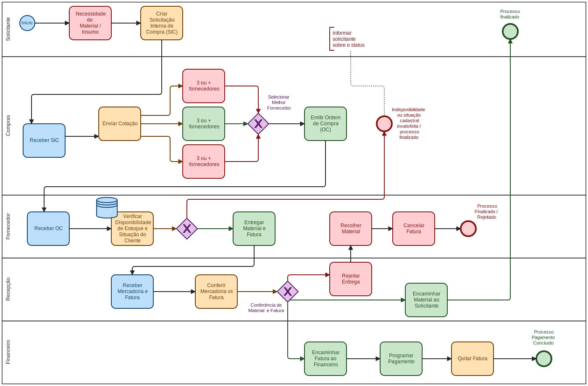
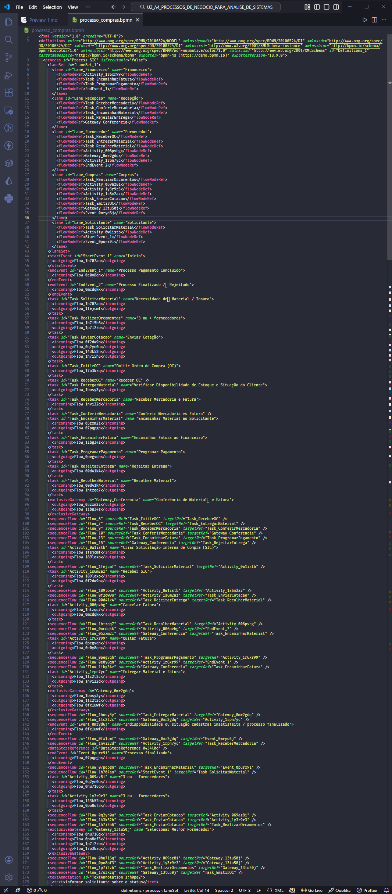

  <p align="center">
    <a href="./images/image_title.png">
      
    </a>  
  </p>

# Atividade Prática: Modelagem BPMN

## Disciplina: Análise e Modelagem de Sistemas

### Unidade 2 – Aula 4

Ministrado por _Profª. Ma. Vanessa Matias Leite_.

<br>

Abaixo segue o resultado do projeto concluído:

<br>

> 🎯 Objetivo da Atividade:
>
> - Identificar e aplicar corretamente os `símbolos padrões` do **_[BPMN](https://www.bpmn.org/)_** em um diagrama.
> - Criar um diagrama **_[BPMN](https://www.bpmn.org/)_** para um `processo de negócio` de compras empresarial.
> - Demonstrar compreensão das `interações` e `fluxos de trabalho` entre diferentes setores.
> - Utilizar `rails (pools / lanes)` para separação visual dos setores organizacionais.

<br>

### 🧩 Features

- Modelagem completa do processo de Solicitação Interna de Compra (SIC).
- Representação de fluxo com múltiplos fornecedores e cotações.
- Diagramação das interações entre setores (Compras, Recepção, Financeiro).
- Implementação de gateways para decisões e condições.
- Utilização de eventos de início, fim e intermediários.
- Aplicação de tarefas, subprocessos e mensagens.
- Modelagem de tratamento de exceções e erros.

---

<table align="center">
  <tr>
    <td align="center">
      <a href="./images/result_activity_1.png">
        
      </a>
      <br>
      <a href="./images/diagram.svg">
        
      </a>
    </td>
    <td align="center">
      <a href="./images/result_activity_2.png">
        
      </a>
    </td>
  </tr>  
</table>

---

### 📚 Pré-requisitos

- [ ] Antes de iniciar este projeto, você deve ter conhecimento básico nas seguintes áreas:

- **Conceitos de BPMN:** Notação básica e elementos principais do diagrama.
- **Processos de Negócio:** Noções de fluxos de trabalho empresariais.
- **Setores Organizacionais:** Compreensão de departamentos como Compras, Financeiro, Recepção.
- **Ferramentas de Modelagem:** Familiaridade com ferramentas de diagramação.
- **Navegação Web:** Habilidade para usar ferramentas online.

---

### 🛠️ Tecnologias Utilizadas

A Atividade foi desenvolvida utilizando:

[](https://code.visualstudio.com/)&nbsp;&nbsp;&nbsp;&nbsp;&nbsp;&nbsp;[](https://www.omg.org/bpmn/)&nbsp;&nbsp;&nbsp;&nbsp;&nbsp;&nbsp;[](https://bpmn.io/)&nbsp;&nbsp;&nbsp;&nbsp;&nbsp;&nbsp;[](https://en.wikipedia.org/wiki/Business_process)

---

### 📂 Estrutura do Projeto

```bash
U2_A4_PROCESSOS_NEGOCIO_ANALISE_SISTEMAS/
├── images/
│   ├── diagram.svg
│   ├── diagrama_finalizado.pdf
│   ├── image_title.png
│   ├── logo_BPMNio.png
│   ├── mini_logo_BPMNio.png
│   ├── result_activity_1.png
│   └── result_activity_2.png
├── ATIVIDADE_PRATICA_U2_A4_PROCESSOS_NEGOCIO_ANALISE_SISTEMAS.pdf
├── README.md              # Este arquivo
├── processo_compras.bpmn  # Arquivo do diagrama BPMN
└── roteiro_U2_A4_PROCESSOS_NEGOCIO_ANALISE_SISTEMAS.pdf
```

---

### ⚙️ Configuração e Execução

- [ ] &nbsp;&nbsp;&nbsp;Pré-requisitos:
      ✔️ - Acesso à internet e navegador web.

<br>

- [x] &nbsp;&nbsp;&nbsp;Forma recomendada (conforme roteiro da disciplina) ➡ Acesse o bpmn.io e siga os passos:

```markdown
Passo 1: Acesse https://bpmn.io
Passo 2: Clique em "Try Online"
Passo 3: Clique em "Create" para iniciar novo diagrama

Passo 4: Estruturar o diagrama com pools/lanes:

- Pool: Processo de Compras
- Lanes:
  - Solicitante
  - Setor de Compras
  - Fornecedores
  - Setor de Recepção
  - Setor Financeiro

Passo 5: Modelar fluxo principal:

- Evento Início: Solicitação Interna de Compra (SIC)
- Tarefa: Realizar orçamentos (mínimo 3 fornecedores)
- Tarefa: Fazer cotações
- Gateway: Selecionar melhor condição comercial
- Tarefa: Elaborar Ordem de Compra (OC)
- Tarefa: Enviar OC ao fornecedor selecionado

Passo 6: Modelar fluxo de recebimento:

- Tarefa: Recepção da mercadoria e fatura
- Tarefa: Conferência da mercadoria
- Gateway: Material está correto?
  - Sim: Encaminhar material e fatura
  - Não: Rejeitar entrega

Passo 7: Finalizar processo:

- Tarefa: Programação do pagamento
- Evento Fim: Processo concluído
```

---

### 🔬 Testes Realizados

✔️ - Verificações do diagrama :

- [x] &nbsp;&nbsp;&nbsp;Utilização correta dos símbolos padrões BPMN.
- [x] &nbsp;&nbsp;&nbsp;Separação adequada em rails por setores organizacionais.
- [x] &nbsp;&nbsp;&nbsp;Representação completa do fluxo de Solicitação Interna de Compra.
- [x] &nbsp;&nbsp;&nbsp;Inclusão de pelo menos três fornecedores no processo de cotação.
- [x] &nbsp;&nbsp;&nbsp;Implementação de gateways para decisões (material correto/incorreto).
- [x] &nbsp;&nbsp;&nbsp;Fluxo alternativo para tratamento de erros na entrega.
- [x] &nbsp;&nbsp;&nbsp;Eventos de início e fim claramente definidos.

---

### 🧠 Habilidades Desenvolvidas

✔️ - Ao concluir esta atividade, você terá adquirido as seguintes habilidades e sub-habilidades :

- Criação de diagramas BPMN seguindo o padrão 2.0.
- Aplicação correta de elementos BPMN (tarefas, eventos, gateways, fluxos).
- Modelagem de processos de negócio com múltiplos participantes.
- Utilização de pools e lanes para organização departamental.
- Representação de fluxos alternativos e tratamento de exceções.
- Análise e documentação de processos empresariais complexos.
- Habilidade em ferramentas de modelagem de processos (bpmn.io).
- Capacidade de comunicar fluxos de trabalho visualmente.

---

### 📜 Licença

Por se tratar de um projeto de caráter exclusivamente acadêmico, desenvolvido como atividade prática da disciplina de Análise e Modelagem de Sistemas, ainda não foi atribuída uma licença formal.

O diagrama tem finalidade educativa e de portfólio estudantil, sendo destinado apenas ao aprendizado e à avaliação no âmbito da faculdade. Caso deseje reutilizar ou adaptar o material para fins didáticos, sinta-se à vontade — apenas mantenha a referência ao autor original e ao contexto acadêmico.

---

<h4 align="center">
  👨‍💻 Desenvolvido por 
<h4/>
<br>

<table align="center">
  <tr>
    <td align="center">
      <a href="https://www.linkedin.com/in/edmar-radanovis/">
        <br>
        <sub><b>Edmar Radanovis</b></sub><br>
        <sub>Desenvolvedor Full Stack &nbsp;&</sub><br>
        <sub>Bacharelando em</sub><br>
        <sub>Engenharia de Software</sub>
      </a>
    </td>
    <td align="center">
      <a href="https://edwebdev.vercel.app/">
        <br>
        <sub><b>Ed Web Dev</b></sub><br>
      </a>
    </td>
  </tr>
</table>
<br>
<br>

[⬆ Voltar ao topo](#atividade-prática-modelagem-bpmn)
