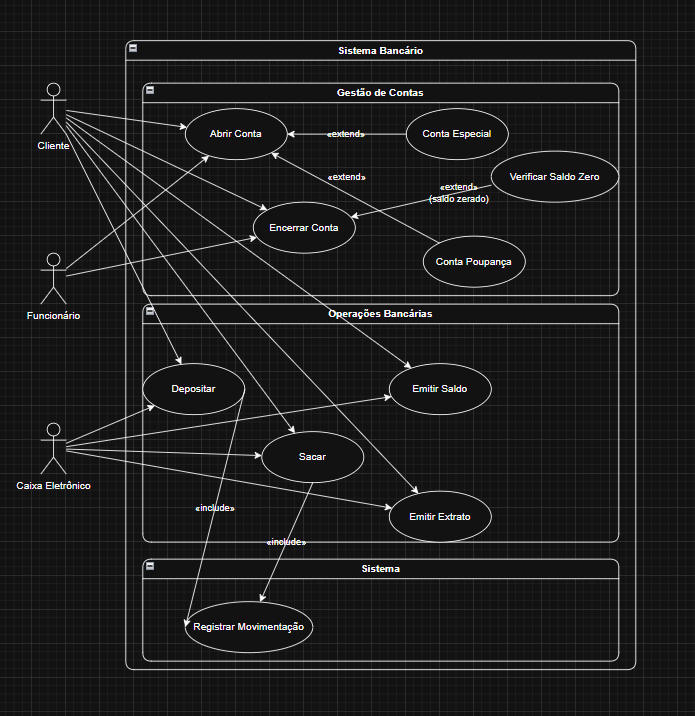

  <p align="center">
    
  </p>

# Atividade Prática: Diagrama de Casos de Uso

## Disciplina: Análise e Modelagem de Sistemas

### Unidade 4 – Aula 2

Ministrado por _Profª. Ma. Vanessa Matias Leite_.

<br>

Abaixo segue o resultado do projeto concluído:

<br>

> 🎯 Objetivo da Atividade:
>
> - Desenvolver um `diagrama de casos de uso` utilizando os conhecimentos e práticas da **_[UML](https://www.uml.org/)_**.
> - Utilizar a linguagem de modelagem para `abstrair` e `resolver` problemas de sistema bancário.
> - Identificar corretamente `atores` e `casos de uso` em um contexto real.
> - Aplicar relacionamentos `include` e `extend` conforme padrões UML.

<br>

### 🧩 Features

- Modelagem completa do sistema bancário com múltiplos atores.
- Identificação de casos de uso para cliente e funcionário.
- Representação de diferentes tipos de conta (especial e poupança).
- Diagramação de operações bancárias (depósito, saque, extrato).
- Implementação de relacionamentos include e extend.
- Validação de regras de negócio (saldo zerado para encerramento).
- Registro de movimentações no sistema.

---

<table align="center">
  <tr>
    <td align="center">
      <a href="./images/result_activity_1.png">
        
      </a>
    </td>
  </tr>  
</table>

---

### 📚 Pré-requisitos

- [ ] Antes de iniciar este projeto, você deve ter conhecimento básico nas seguintes áreas:

- **Conceitos de UML:** Fundamentos da Unified Modeling Language.
- **Diagrama de Casos de Uso:** Elementos principais (atores, casos de uso, relacionamentos).
- **Sistemas Bancários:** Noções básicas de operações financeiras.
- **Ferramentas de Modelagem:** Familiaridade com software de diagramação UML.
- **Relacionamentos UML:** Compreensão de include, extend e generalização.

---

### 🛠️ Tecnologias Utilizadas

A Atividade foi desenvolvida utilizando:

[](https://code.visualstudio.com/)&nbsp;&nbsp;&nbsp;&nbsp;&nbsp;&nbsp;[](https://www.uml.org/)&nbsp;&nbsp;&nbsp;&nbsp;&nbsp;&nbsp;[](https://online.visual-paradigm.com/)&nbsp;&nbsp;&nbsp;&nbsp;&nbsp;&nbsp;[](https://en.wikipedia.org/wiki/Use_case_diagram)&nbsp;&nbsp;&nbsp;&nbsp;&nbsp;&nbsp;[](https://app.diagrams.net/)

---

### 📂 Estrutura do Projeto

```bash
U4_A2_MODELAGEM_DE_SISTEMAS/
├── images/
│   ├── diagrama_finalizado.pdf
│   ├── diagrama_sistema_bancario_UML.png
│   ├── logo_VP.png
│   ├── mini_logo_VP.png
│   ├── result_activity_1.png
│   └── result_activity_2.png
├── ATIVIDADE_PRATICA_U4_A2_MODELAGEM_DE_SISTEMAS.pdf
├── README.md                               # Este arquivo
├── diagrama_sistema_bancario_UML.xml       # Arquivo do diagrama UML
└── roteiro_U4_A2_MODELAGEM_DE_SISTEMAS.pdf
```

---

### ⚙️ Configuração e Execução

- [ ] &nbsp;&nbsp;&nbsp;Pré-requisitos:

✔️ - Acesso à internet e navegador web.

<br>

- [x] &nbsp;&nbsp;&nbsp;Forma recomendada (conforme roteiro da disciplina) ➡ Acesse o Visual Paradigm Online e siga os passos:

```markdown
Passo 1: Acesse https://online.visual-paradigm.com
Passo 2: Faça login ou crie uma conta gratuita
Passo 3: Clique em "Create New Diagram"
Passo 4: Filtre por "Use Case Diagram" e clique em "Create"

Passo 5: Identificar e adicionar atores:

- Ator Principal: Cliente
- Ator Secundário: Funcionário
- Sistema Externo: Caixa Eletrônico

Passo 6: Definir casos de uso principais:

- Abrir Conta (com funcionário)
- Encerrar Conta (com funcionário)
- Depositar Dinheiro (via caixa eletrônico)
- Sacar Dinheiro (via caixa eletrônico)
- Emitir Saldo (via caixa eletrônico)
- Emitir Extrato (via caixa eletrônico)
- Registrar Movimentação (sistema automático)

Passo 7: Especificar tipos de conta:

- Abrir Conta Especial
- Abrir Conta Poupança

Passo 8: Aplicar relacionamentos:

- Include: Encerrar Conta → Verificar Saldo Zerado
- Extend: Casos de uso com condições específicas
- Associações entre atores e casos de uso

Passo 9: Validar regras de negócio:

- Saldo deve estar zerado para encerrar conta
- Todas as movimentações devem ser registradas
- Operações específicas por tipo de canal (caixa vs funcionário)
```

---

### 🔬 Testes Realizados

✔️ - Verificações do diagrama :

- [x] &nbsp;&nbsp;&nbsp;Identificação correta de todos os atores do sistema.
- [x] &nbsp;&nbsp;&nbsp;Representação completa dos casos de uso solicitados.
- [x] &nbsp;&nbsp;&nbsp;Aplicação adequada de relacionamentos include e extend.
- [x] &nbsp;&nbsp;&nbsp;Diferenciação entre tipos de conta (especial e poupança).
- [x] &nbsp;&nbsp;&nbsp;Separação de operações por canal (caixa eletrônico vs funcionário).
- [x] &nbsp;&nbsp;&nbsp;Implementação da regra de saldo zerado para encerramento.
- [x] &nbsp;&nbsp;&nbsp;Inclusão do registro automático de movimentações.

---

### 🧠 Habilidades Desenvolvidas

✔️ - Ao concluir esta atividade, você terá adquirido as seguintes habilidades e sub-habilidades :

- Criação de diagramas de casos de uso seguindo padrão UML 2.0.
- Identificação e modelagem de atores em sistemas complexos.
- Aplicação correta de relacionamentos (associação, include, extend).
- Representação de regras de negócio através de diagramas UML.
- Modelagem de sistemas bancários com múltiplos canais de atendimento.
- Habilidade em ferramentas de modelagem UML (Visual Paradigm).
- Capacidade de abstrair requisitos funcionais em diagramas visuais.
- Documentação de sistemas para desenvolvimento de software.

---

### 📜 Licença

Por se tratar de um projeto de caráter exclusivamente acadêmico, desenvolvido como atividade prática da disciplina de Análise e Modelagem de Sistemas, ainda não foi atribuída uma licença formal.

O diagrama tem finalidade educativa e de portfólio estudantil, sendo destinado apenas ao aprendizado e à avaliação no âmbito da faculdade. Caso deseje reutilizar ou adaptar o material para fins didáticos, sinta-se à vontade — apenas mantenha a referência ao autor original e ao contexto acadêmico.

---

<h4 align="center">
  👨‍💻 Desenvolvido por 
<h4/>
<br>

<table align="center">
  <tr>
    <td align="center">
      <a href="https://www.linkedin.com/in/edmar-radanovis/">
        <br>
        <sub><b>Edmar Radanovis</b></sub><br>
        <sub>Desenvolvedor Full Stack &nbsp;&</sub><br>
        <sub>Bacharelando em</sub><br>
        <sub>Engenharia de Software</sub>
      </a>
    </td>
    <td align="center">
      <a href="https://edwebdev.vercel.app/">
        <br>
        <sub><b>Ed Web Dev</b></sub><br>
      </a>
    </td>
  </tr>
</table>
<br>
<br>

[⬆ Voltar ao topo](#atividade-prática-diagrama-de-casos-de-uso)
