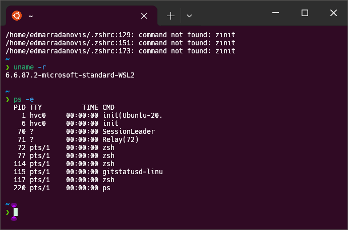
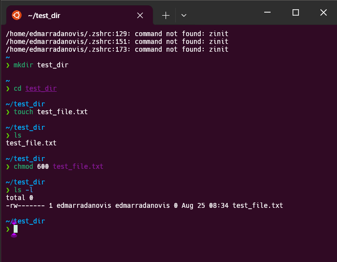
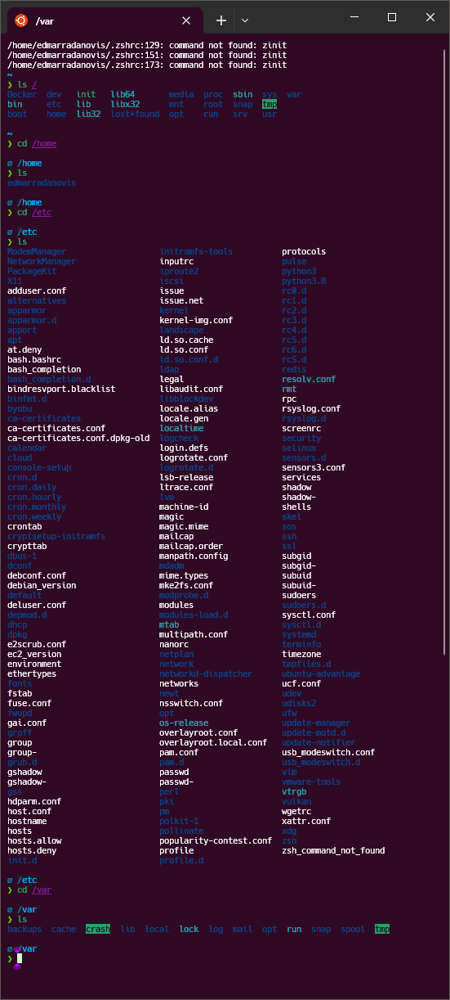
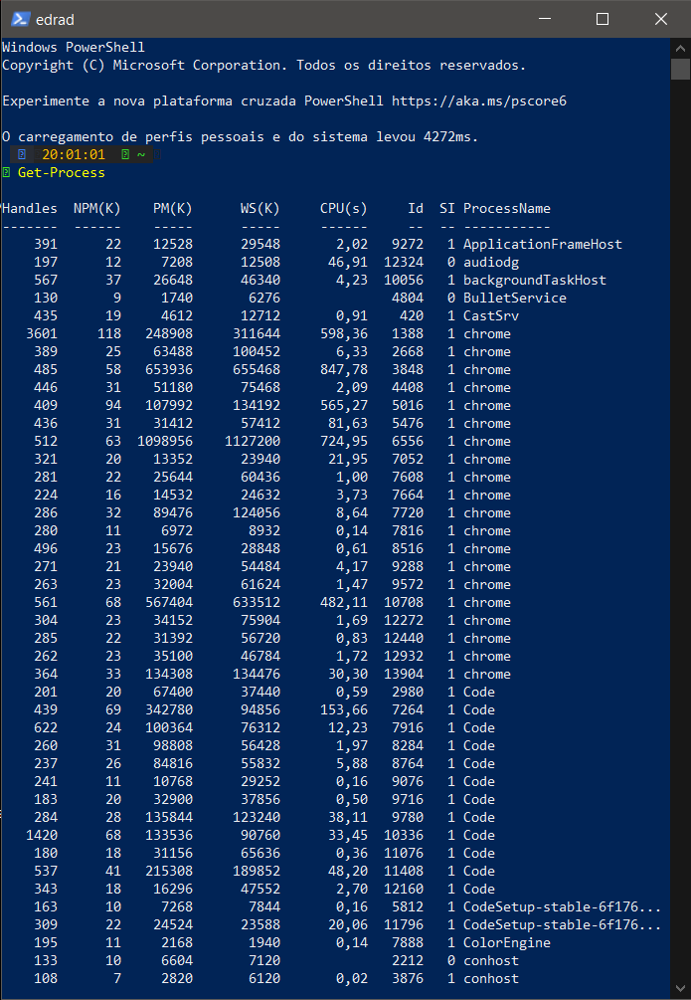
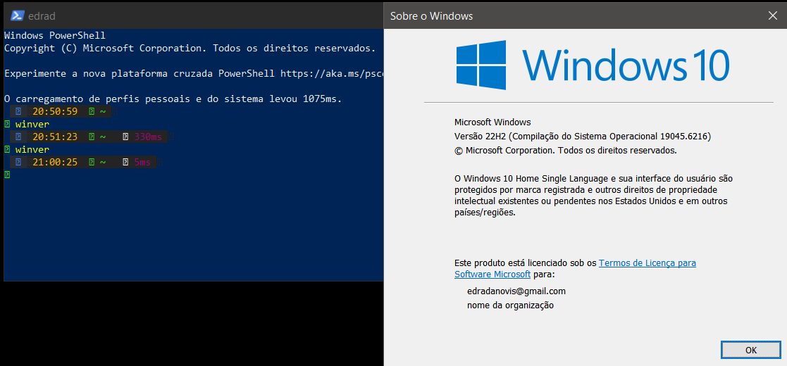
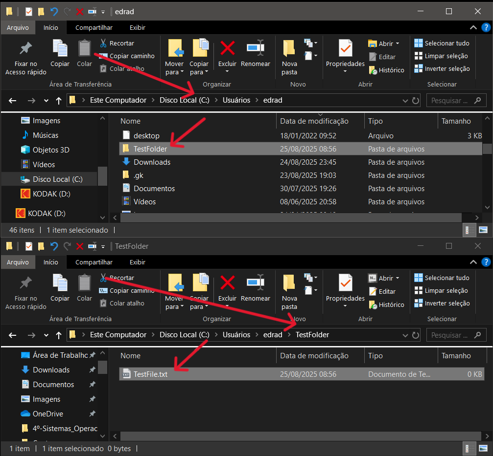
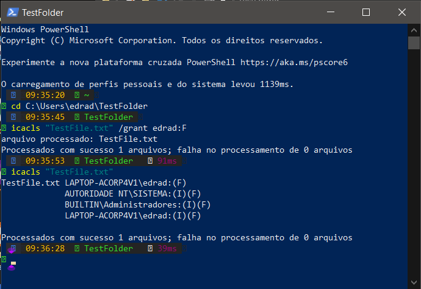
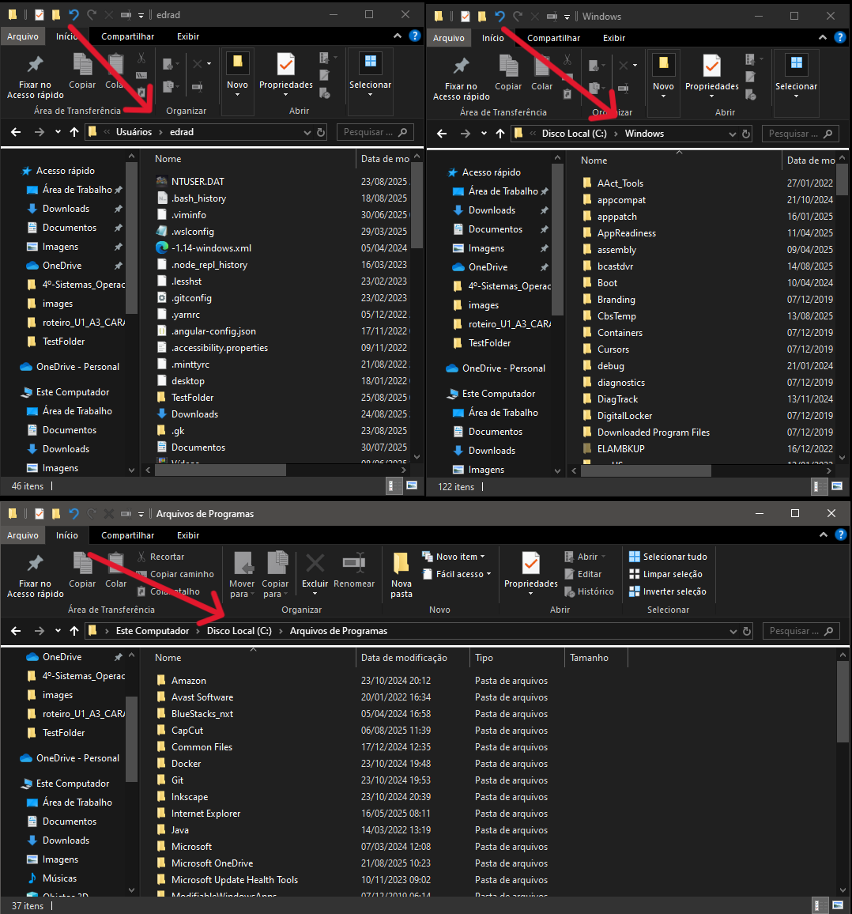

<div align="center">


</div>

# Atividade Prática: Características dos Sistemas Operacionais

## Disciplina: Sistemas Operacionais

### Unidade 1 – Aula 3

Ministrado por _Profº Me. Rômulo de Almeida Neves_.

<br>

Abaixo segue o resultado da atidade concluída:

<br>

> 🎯 Objetivo:
>
> - Desenvolver a compreensão dos principais componentes dos sistemas operacionais **_[Linux](https://www.linux.org/)_** e **_[Windows](https://www.microsoft.com/pt-br/windows/?r=1)_**.
> - Explorar o `kernel` , `shell` e `gerenciamento de arquivos` nos sistemas operacionais.
> - Aprender sobre organização do sistema de arquivos e configuração de permissões.
> - Comparar estruturas de diretórios entre `Linux` e `Windows`. ✅

<br>

### 🧩 Features

- Identificação de versão do kernel nos sistemas Linux e Windows.
- Listagem de processos ativos em ambos os sistemas operacionais.
- Criação e gerenciamento de permissões de arquivos e diretórios.
- Exploração da estrutura de diretórios raiz e principais pastas.
- Comparação das arquiteturas de sistemas de arquivos Linux vs Windows.

---

<table align="center">
  <tr>
    <td align="center">
      <a href="./images/linux_1.png">
        
      </a>
    </td>
    <td align="center">
      <a href="./images/linux_2.png">
        
      </a>
    </td>
    <td align="center">
      <a href="./images/linux_3.png">
        
      </a>
    </td>
    <td align="center">
      <a href="./images/windows_1.0.png">
        
      </a>
    </td>
  </tr>
</table>
<table align="center">
  <tr>
    <td align="center">
      <a href="./images/windows_1.1.png">
        
      </a>
    </td>
    <td align="center">
      <a href="./images/windows_2.0.png">
        
      </a>
    </td>
    <td align="center">
      <a href="./images/windows_2.1.png">
        
      </a>
    </td>
    <td align="center">
      <a href="./images/windows_3.png">
        
      </a>
    </td>
  </tr>
</table>

---

### 📚 Pré-requisitos

- [ ] Antes de iniciar esta atividade, você deve ter conhecimento básico nas seguintes áreas:

- **Conceitos Básicos de SO :** Noções de kernel, shell e sistemas de arquivos.
- **Linha de Comando :** Experiência básica com terminal / console.
- **Sistemas Linux :** Familiaridade com comandos básicos do terminal.
- **Windows :** Conhecimento do PowerShell ou Prompt de Comando.
- **Permissões de Arquivo :** Conceitos básicos de leitura, escrita e execução.

---

### 🛠️ Tecnologias Utilizadas

A Atividade foi desenvolvida utilizando:

[](https://www.linux.org/)&nbsp;&nbsp;&nbsp;&nbsp;&nbsp;&nbsp;[](https://www.microsoft.com/pt-br/windows/?r=1)&nbsp;&nbsp;&nbsp;&nbsp;&nbsp;&nbsp;[](https://www.gnu.org/software/bash/)&nbsp;&nbsp;&nbsp;&nbsp;&nbsp;&nbsp;[](https://learn.microsoft.com/pt-br/powershell/scripting/install/install-powershell-on-windows?view=powershell-7.5)

---

#### ⚙️ Configuração e Execução

- [x] &nbsp;&nbsp;&nbsp;Pré-requisitos:

✔️ - Sistema Linux (Ubuntu, Fedora, etc.) e Windows 10 / 11.

✔️ - Acesso ao terminal Linux e PowerShell do Windows.

- [x] &nbsp;&nbsp;&nbsp;Para executar no Linux:

```bash

# Identificar versão do kernel
uname -r

# Listar processos
ps -e

# Gerenciar arquivos e permissões
mkdir test_dir
cd test_dir
touch test_file.txt
chmod 600 test_file.txt
ls -l
```

- [x] &nbsp;&nbsp;&nbsp;Para executar no Windows:

```bash

# Listar processos
Get-Process

# Verificar versão do Windows
winver

# Gerenciar permissões
mkdir TestFolder
cd TestFolder
echo "" > TestFile.txt
icacls TestFile.txt /grant %username%:F
```

---

#### 🔬 Testes

✔️ - Testes práticos realizados:

- [x] &nbsp;&nbsp;&nbsp; Identificação correta da versão do kernel no Linux.
- [x] &nbsp;&nbsp;&nbsp; Listagem de processos ativos em ambos os sistemas.
- [x] &nbsp;&nbsp;&nbsp; Criação e configuração de permissões de arquivos.
- [x] &nbsp;&nbsp;&nbsp; Exploração da estrutura de diretórios raiz.
- [x] &nbsp;&nbsp;&nbsp; Comparação entre /home, /etc, /var (Linux) e C:\Users, C:\Windows (Windows).
- [x] &nbsp;&nbsp;&nbsp; Verificação de permissões aplicadas.

---

### 🧠 Habilidades Desenvolvidas

✔️ - Ao concluir esta atividade, você terá adquirido as seguintes habilidades e sub-habilidades :

- Compreensão das funções do kernel e shell em sistemas operacionais.
- Habilidade em comandos essenciais do terminal Linux e PowerShell.
- Gerenciamento de permissões de arquivos e diretórios.
- Conhecimento da estrutura de sistemas de arquivos Linux e Windows.
- Capacidade de comparar arquiteturas de diferentes sistemas operacionais.
- Habilidade em troubleshooting básico de sistemas.
- Entendimento de ambientes multiusuário e segurança de acesso.

---

#### 📜 Licença

Por se tratar de um projeto de caráter exclusivamente acadêmico, desenvolvido como atividade prática da disciplina de Sistemas Operacionais, ainda não foi atribuída uma licença formal de software (como MIT, GPL ou outra).

O material tem finalidade educativa e de portfólio estudantil, sendo destinado apenas ao aprendizado e à avaliação no âmbito da faculdade. Caso deseje reutilizar ou adaptar o conteúdo para fins didáticos, sinta-se à vontade — apenas mantenha a referência ao autor original e ao contexto acadêmico.

---

<h4 align="center">
  👨‍💻 Desenvolvido por 
<h4/>
<br>

<table align="center">
  <tr>
    <td align="center">
      <a href="https://www.linkedin.com/in/edmar-radanovis/">
        <br>
        <sub><b>Edmar Radanovis</b></sub><br>
        <sub>Desenvolvedor Full Stack &nbsp;&</sub><br>
        <sub>Bacharelando em</sub><br>
        <sub>Engenharia de Software</sub>
      </a>
    </td>
    <td align="center">
      <a href="https://edwebdev.vercel.app/">
        <br>
        <sub><b>Ed Web Dev</b></sub><br>
      </a>
    </td>
  </tr>
</table>
<br>
<br>

[⬆ Voltar ao topo](#atividade-prática-características-dos-sistemas-operacionais)
