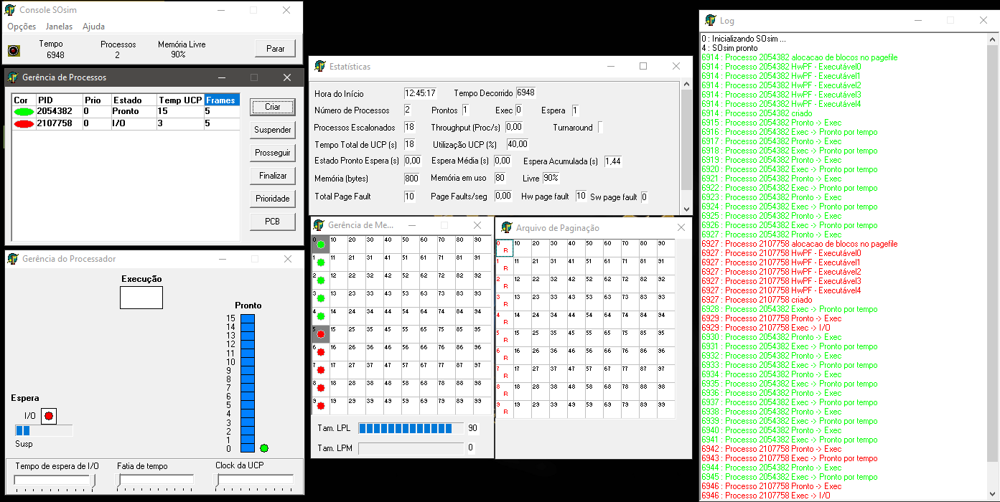
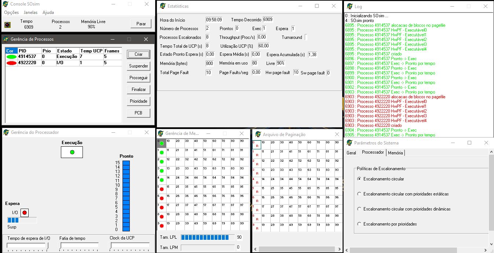
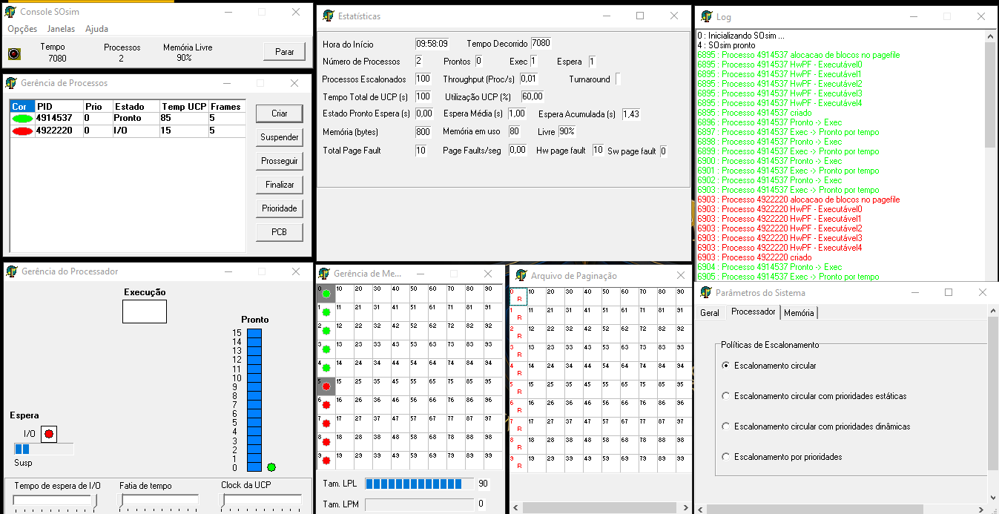
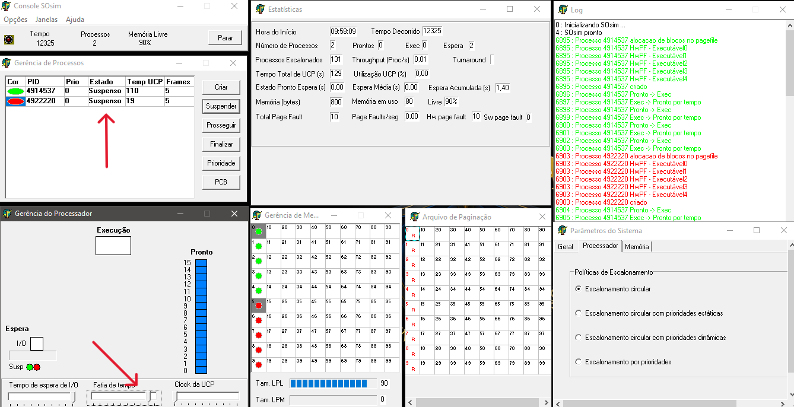
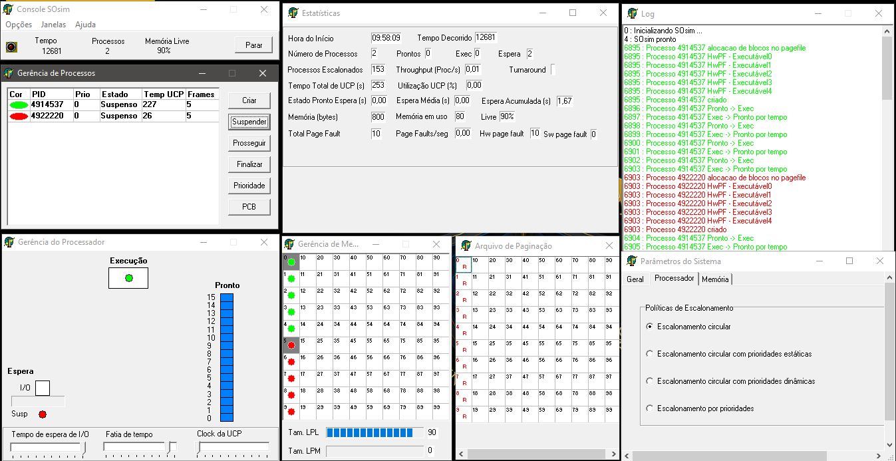

<div align="center">


</div>

# Atividade Prática: Processos e Threads - Conceito e Gerenciamento

## Disciplina: Sistemas Operacionais

### Unidade 2 – Aula 1

Ministrado por _Profº Me. Rômulo de Almeida Neves_.

<br>

Abaixo segue o resultado da atividade concluída:

<br>

> 🎯 Objetivo:
>
> - Compreensão, análise e aplicações relacionados a **_processos_** em sistemas operacionais.
> - Explorar a `criação` , `eliminação` e `mudanças de estado` nos processos.
> - Utilizar o simulador **_[SOsim](https://www.training.com.br/sosim/)_** para visualização prática dos conceitos de multiprogramação.
> - Analisar políticas de `escalonamento circular` e `gerência de processador`. ✅

<br>

### 🧩 Features

- Download e configuração do simulador SOsim para estudos de sistemas operacionais.
- Criação e análise de processos `CPU-bound` e `I/O-bound`.
- Observação de mudanças de estado e mudanças de contexto entre processos.
- Configuração e análise do escalonamento circular com diferentes fatias de tempo.
- Monitoramento de estatísticas em tempo real através das janelas do simulador.
- Comparação de concorrência entre processos com diferentes parâmetros de sistema.

---

<table align="center">
  <tr>
    <td align="center">
      <a href="./images/1_criacao_processos.png">
        
      </a>
    </td>
    <td align="center">
      <a href="./images/2.0_processos_com_mesma_prioridade.png">
        
      </a>
    </td>
    <td align="center">
      <a href="./images/2.1_processos_com_mesma_prioridade.png">
        
      </a>
    </td>
  </tr>
</table>
<table align="center">
  <tr>
    <td align="center">
      <a href="./images/2.2_processos_com_mesma_prioridade.png">
        
      </a>
    </td>
    <td align="center">
      <a href="./images/2.3_processos_com_mesma_prioridade.png">
        
      </a>
    </td>
  </tr>
</table>

---

### 📚 Pré-requisitos

- [ ] Antes de iniciar esta atividade, você deve ter conhecimento básico nas seguintes áreas:

- **Conceitos de Processos:** Noções de processos, threads e estados de processos.
- **Sistemas Operacionais:** Compreensão básica de multiprogramação e escalonamento.
- **SOsim:** Familiaridade com a interface do simulador (é adquirida durante a atividade).
- **Terminologia:** Conceitos de CPU - bound, I / O - bound, fatia de tempo e mudanças de contexto.

---

### 🛠️ Tecnologias Utilizadas

A Atividade foi desenvolvida utilizando:

[](http://www.training.com.br/sosim/)&nbsp;&nbsp;&nbsp;&nbsp;&nbsp;&nbsp;[](https://www.microsoft.com/pt-br/windows/?r=1)&nbsp;&nbsp;&nbsp;&nbsp;&nbsp;&nbsp;[](http://www.training.com.br/sosim/)&nbsp;&nbsp;&nbsp;&nbsp;&nbsp;&nbsp;[](https://pt.wikipedia.org/wiki/Sistema_operativo)

---

#### ⚙️ Configuração e Execução

- [x] &nbsp;&nbsp;&nbsp;Pré-requisitos:

✔️ - Download do SOsim em: http://www.training.com.br/sosim/

✔️ - Sistema Windows para execução do simulador.

✔️ - Conhecimento básico de conceitos de processos e escalonamento.

<br>

- [x] &nbsp;&nbsp;&nbsp;Atividade 1 - Configuração Inicial do SOsim:

```bash
# 1. Fazer download do SOsim no site oficial
# 2. Extrair e executar o aplicativo
# 3. Abrir todas as janelas: Console SOsim, Gerência de Processos,
#    Gerência do Processador, Gerência de Memória, Arquivo de paginação,
#    Estatísticas e Log
```

<br>

- [x] &nbsp;&nbsp;&nbsp;Atividade 2 - Criação de Processos:

```bash
# Criar processo CPU-bound:
# Gerência de Processos → Criar → Tipo: CPU-bound

# Criar processo I/O-bound:
# Gerência de Processos → Criar → Tipo: I/O-bound

# Observar mudanças de estado e comportamento
```

<br>

- [x] &nbsp;&nbsp;&nbsp;Atividade 3 - Escalonamento Circular:

```bash
# Configurar escalonamento circular:
# Console SOsim → Opções → Parâmetros do Sistema → Guia Processador

# Criar 2 processos com mesma prioridade (CPU-bound e I/O-bound)
# Observar tempo de processador por 2 minutos
# Ajustar fatia de tempo e comparar resultados
```

---

#### 🔬 Testes

✔️ - Testes práticos realizados:

- [x] &nbsp;&nbsp;&nbsp;Download e configuração correta do simulador SOsim.
- [x] &nbsp;&nbsp;&nbsp;Criação de processos CPU-bound e I/O-bound com sucesso.
- [x] &nbsp;&nbsp;&nbsp;Análise das mudanças de estado dos processos.
- [x] &nbsp;&nbsp;&nbsp;Configuração do escalonamento circular.
- [x] &nbsp;&nbsp;&nbsp;Observação do balanceamento no uso do processador.
- [x] &nbsp;&nbsp;&nbsp;Análise comparativa com diferentes fatias de tempo.
- [x] &nbsp;&nbsp;&nbsp;Monitoramento através das janelas de Estatísticas e Log.

---

### 🧠 Habilidades Desenvolvidas

✔️ - Ao concluir esta atividade, você terá adquirido as seguintes habilidades e sub-habilidades :

- Compreensão profunda do conceito de processos e seus estados.
- Habilidade em utilizar simuladores para estudos de sistemas operacionais.
- Capacidade de analisar diferenças entre processos CPU-bound e I/O-bound.
- Conhecimento prático de políticas de escalonamento (circular).
- Habilidade em configurar e ajustar parâmetros do sistema.
- Capacidade de interpretar estatísticas e logs de execução.
- Entendimento de mudanças de contexto e concorrência entre processos.

---

#### 📜 Licença

Por se tratar de um projeto de caráter exclusivamente acadêmico, desenvolvido como atividade prática da disciplina de Sistemas Operacionais, ainda não foi atribuída uma licença formal de software (como MIT, GPL ou outra).

O material tem finalidade educativa e de portfólio estudantil, sendo destinado apenas ao aprendizado e à avaliação no âmbito da faculdade. Caso deseje reutilizar ou adaptar o conteúdo para fins didáticos, sinta-se à vontade — apenas mantenha a referência ao autor original e ao contexto acadêmico.

---

<h4 align="center">
  👨‍💻 Desenvolvido por
<h4/>
<br>

<table align="center">
  <tr>
    <td align="center">
      <a href="https://www.linkedin.com/in/edmar-radanovis/">
        <br>
        <sub><b>Edmar Radanovis</b></sub><br>
        <sub>Desenvolvedor Full Stack &nbsp;&</sub><br>
        <sub>Bacharelando em</sub><br>
        <sub>Engenharia de Software</sub>
      </a>
    </td>
    <td align="center">
      <a href="https://edwebdev.vercel.app/">
        <br>
        <sub><b>Ed Web Dev</b></sub><br>
      </a>
    </td>
  </tr>
</table>
<br>
<br>

[⬆ Voltar ao topo](#atividade-prática-processos-e-threads---conceito-e-gerenciamento)
