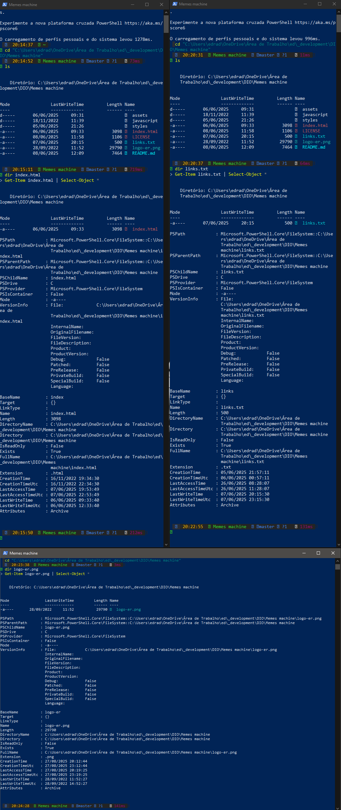
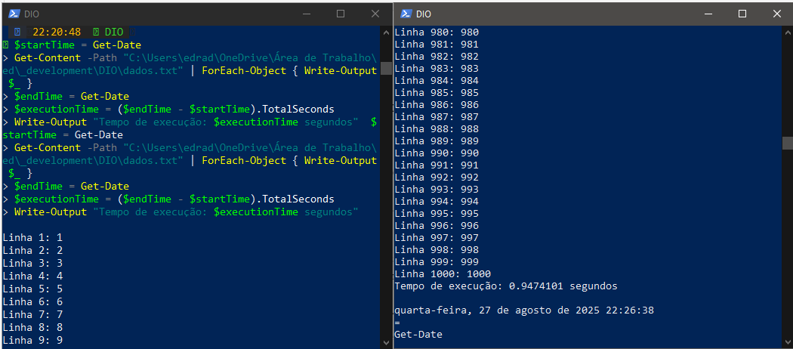
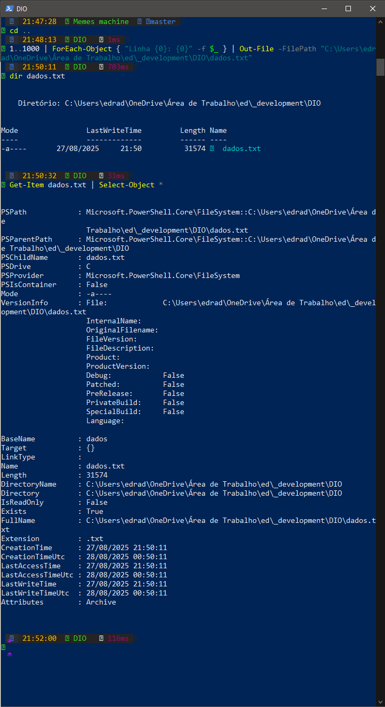
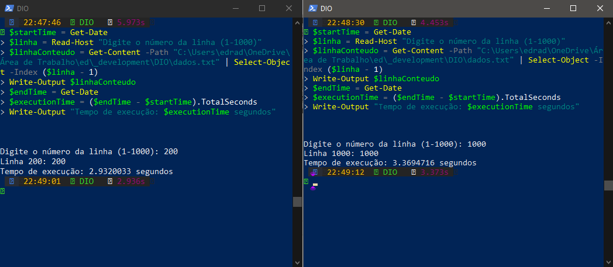

<div align="center">


</div>

# Atividade Prática: Arquivos e Sistemas de Arquivos

## Disciplina: Sistemas Operacionais

### Unidade 3 – Aula 1

Ministrado por _Profº Me. Rômulo de Almeida Neves_.

<br>

Abaixo segue o resultado da atividade concluída:

<br>

> 🎯 Objetivo:
>
> - Compreender e aplicar os conceitos fundamentais de `arquivos` e `sistemas de arquivos`.
> - Explorar a `estrutura de arquivos` , `métodos de acesso e atributos` conforme autores como _Tanenbaum_, _Machado_ e _Maia_.
> - Identificar e analisar `atributos de arquivos` em sistemas **_[Linux](https://www.linux.org/)_** e **_[Windows](https://www.microsoft.com/pt-br/windows/?r=1)_**.
> - Comparar métodos de `acesso sequencial` vs `acesso direto` em termos de eficiência e aplicabilidade. ✅

<br>

### 🧩 Features

- Identificação e análise detalhada de atributos de arquivos em Linux e Windows.
- Utilização de comandos avançados para listagem de metadados de arquivos.
- Criação e manipulação de arquivos de texto com dados sequenciais.
- Desenvolvimento de scripts para acesso sequencial e direto a arquivos.
- Comparação de desempenho entre diferentes métodos de acesso.
- Análise de impacto dos atributos no uso do sistema de arquivos.

---

<table align="center">
  <tr>
    <td align="center">
      <a href="./images/1_listar_atributos_arquivos.png">
        
      </a>
      <br>
      <br>
      <a href="./images/3_script_acesso_sequencial.png">
        
      </a>
    </td>
    <td align="center">
      <a href="./images/2_desenvolvimento_execução_arquivo_dados.png">
        
      </a>
      <br>
      <br>
      <a href="./images/4_script_acesso_direto.png">
        
      </a>
    </td>
  </tr>
</table>

---

### 📚 Pré-requisitos

- [ ] Antes de iniciar esta atividade, você deve ter conhecimento básico nas seguintes áreas:

- **Sistemas de Arquivos:** Noções básicas de organização e estrutura de arquivos.
- **Linha de Comando:** Experiência com terminal Linux e PowerShell Windows.
- **Scripting Básico:** Conhecimento elementar de scripts para automação.
- **Metadados:** Compreensão de atributos como permissões, datas e tamanhos.
- **Métodos de Acesso:** Conceitos de acesso sequencial e aleatório / direto.

---

### 🛠️ Tecnologias Utilizadas

A Atividade foi desenvolvida utilizando:

[](https://www.linux.org/)&nbsp;&nbsp;&nbsp;&nbsp;&nbsp;&nbsp;[](https://www.microsoft.com/pt-br/windows/?r=1)&nbsp;&nbsp;&nbsp;&nbsp;&nbsp;&nbsp;[](https://www.gnu.org/software/bash/)&nbsp;&nbsp;&nbsp;&nbsp;&nbsp;&nbsp;[](https://learn.microsoft.com/pt-br/powershell/scripting/install/install-powershell-on-windows?view=powershell-7.5)&nbsp;&nbsp;&nbsp;&nbsp;&nbsp;&nbsp;[](https://www.python.org/)

---

#### ⚙️ Configuração e Execução

- [x] &nbsp;&nbsp;&nbsp;Pré-requisitos:

✔️ - Sistema Linux (Ubuntu, Fedora, etc.) e Windows 10 / 11.

✔️ - Acesso ao terminal Linux e PowerShell do Windows.

✔️ - Editor de texto para criação de scripts.

- [x] &nbsp;&nbsp;&nbsp;Atividade 1 - Identificação de Atributos:

```bash
# Linux - Listar atributos detalhados
ls -l arquivo.txt
stat arquivo.txt

# Windows - Listar atributos
dir arquivo.txt
Get-Item arquivo.txt | Select-Object *

# Analisar 3 arquivos diferentes e documentar atributos:
# - Nome, tamanho, datas (criação/modificação)
# - Permissões, tipo, proprietário
```

- [x] &nbsp;&nbsp;&nbsp;Atividade 2 - Acesso `Sequencial` vs `Direto`:

```bash
# Criar arquivo de dados sequenciais
echo "Linha 1: Dado A" > dados_sequenciais.txt
echo "Linha 2: Dado B" >> dados_sequenciais.txt
echo "Linha 3: Dado C" >> dados_sequenciais.txt
# ... adicionar mais linhas

# Script Acesso Sequencial (exemplo Python)
python acesso_sequencial.py dados_sequenciais.txt

# Script Acesso Direto (exemplo Python)
python acesso_direto.py dados_sequenciais.txt 5  # Lê linha 5 diretamente
```

- [x] &nbsp;&nbsp;&nbsp;Exemplo de Script Python:

```bash
# acesso_sequencial.py
import time

def acesso_sequencial(arquivo):
    inicio = time.time()
    with open(arquivo, 'r') as f:
        for linha in f:
            print(linha.strip())
    fim = time.time()
    print(f"Tempo sequencial: {fim - inicio:.4f}s")

# acesso_direto.py
def acesso_direto(arquivo, linha_alvo):
    inicio = time.time()
    with open(arquivo, 'r') as f:
        linhas = f.readlines()
        if 0 <= linha_alvo < len(linhas):
            print(linhas[linha_alvo].strip())
    fim = time.time()
    print(f"Tempo direto: {fim - inicio:.4f}s")
```

---

#### 🔬 Testes

✔️ - Testes práticos realizados:

- [x] &nbsp;&nbsp;&nbsp; Identificação correta de atributos em 3 arquivos diferentes.
- [x] &nbsp;&nbsp;&nbsp; Análise detalhada de metadados no Linux e Windows.
- [x] &nbsp;&nbsp;&nbsp; Criação de arquivo de dados sequenciais com sucesso.
- [x] &nbsp;&nbsp;&nbsp; Desenvolvimento de scripts para acesso sequencial e direto.
- [x] &nbsp;&nbsp;&nbsp; Medição e comparação de tempos de execução.
- [x] &nbsp;&nbsp;&nbsp; Análise de eficiência entre métodos de acesso.
- [x] &nbsp;&nbsp;&nbsp; Documentação de situações ideais para cada método.

---

### 🧠 Habilidades Desenvolvidas

✔️ - Ao concluir esta atividade, você terá adquirido as seguintes habilidades e sub-habilidades :

- Compreensão profunda de atributos e metadados de arquivos.
- Habilidade em comandos avançados de listagem de arquivos.
- Capacidade de analisar impactos dos atributos no uso do sistema.
- Conhecimento prático de métodos de acesso sequencial e direto.
- Habilidade em desenvolvimento de scripts para manipulação de arquivos.
- Capacidade de comparar eficiência entre diferentes abordagens.
- Entendimento de situações aplicáveis para cada método de acesso.

---

#### 📜 Licença

Por se tratar de um projeto de caráter exclusivamente acadêmico, desenvolvido como atividade prática da disciplina de Sistemas Operacionais, ainda não foi atribuída uma licença formal de software (como MIT, GPL ou outra).

O material tem finalidade educativa e de portfólio estudantil, sendo destinado apenas ao aprendizado e à avaliação no âmbito da faculdade. Caso deseje reutilizar ou adaptar o conteúdo para fins didáticos, sinta-se à vontade — apenas mantenha a referência ao autor original e ao contexto acadêmico.

---

<h4 align="center">
  👨‍💻 Desenvolvido por 
<h4/>
<br>

<table align="center">
  <tr>
    <td align="center">
      <a href="https://www.linkedin.com/in/edmar-radanovis/">
        <br>
        <sub><b>Edmar Radanovis</b></sub><br>
        <sub>Desenvolvedor Full Stack &nbsp;&</sub><br>
        <sub>Bacharelando em</sub><br>
        <sub>Engenharia de Software</sub>
      </a>
    </td>
    <td align="center">
      <a href="https://edwebdev.vercel.app/">
        <br>
        <sub><b>Ed Web Dev</b></sub><br>
      </a>
    </td>
  </tr>
</table>
<br>
<br>

[⬆ Voltar ao topo](#atividade-prática-arquivos-e-sistemas-de-arquivos)
