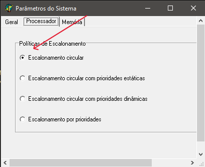
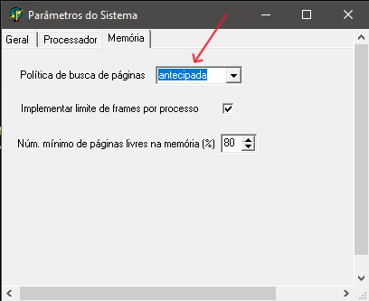
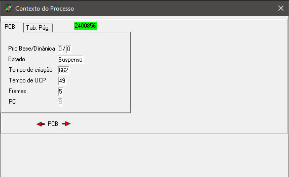
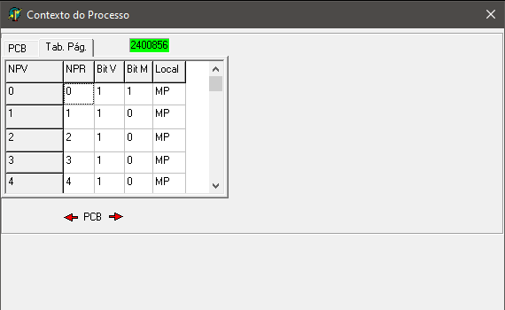
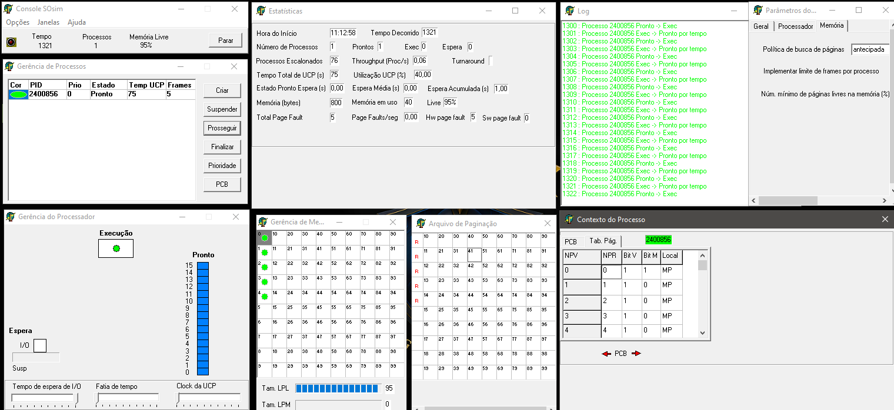

<div align="center">


</div>

# Atividade Prática: Monoprogramação sem Troca de Processos ou Paginação

## Disciplina: Sistemas Operacionais

### Unidade 4 – Aula 3

Ministrado por _Profº Me. Rômulo de Almeida Neves_.

<br>

Abaixo segue o resultado da atividade concluída:

<br>

> 🎯 Objetivo:
>
> - Compreensão, análise e aplicações relacionados a `paginação` em sistemas operacionais.
> - Explorar os conceitos de `memória virtual` e `gerência de memória` através do simulador **_[SOsim](https://www.training.com.br/sosim/)_**.
> - Configurar e analisar `políticas de busca de páginas antecipada`.
> - Visualizar `tabelas de páginas e bits de validade` em processos CPU-bound. ✅

<br>

### 🧩 Features

- Download e configuração do simulador SOsim para estudos avançados.
- Configuração de escalonamento circular e políticas de memória virtual.
- Criação e análise de processos CPU - bound com paginação ativa.
- Ativação e monitoramento da janela de arquivos de paginação.
- Visualização detalhada da tabela de páginas através do Contexto do Processo.
- Análise dos bits de validade nas entradas das tabelas de páginas (ETP).
- Configuração de parâmetros avançados do sistema.

---

<table align="center">
  <tr>
    <td align="center">
      <a href="./images/1_escalonamento_circular.png">
        
      </a>
    </td>
    <td align="center">
      <a href="./images/2_busca_paginas_antecipada.png">
        
      </a>
    </td>
    <td align="center">
      <a href="./images/3.1_contexto_do_processo_PCB.png">
        
      </a>
    </td>
    <td align="center">
      <a href="./images/3.2_contexto_do_processo_tabpag.png">
        
      </a>
    </td>
  </tr>
</table>
<table align="center">
  <tr>
    <td align="center">
      <a href="./images/4_contexto_geral.png">
        
      </a>
    </td>
  </tr>
</table>

---

### 📚 Pré-requisitos

- [ ] Antes de iniciar esta atividade, você deve ter conhecimento básico nas seguintes áreas:

- **Conceitos de Memória Virtual:** Noções de paginação e memória virtual.
- **SOsim Básico:** Familiaridade com a interface do simulador.
- **Processos e Estados:** Compreensão de processos CPU - bound e seus estados.
- **Tabelas de Páginas:** Conceitos básicos de organização de memória.
- **Bits de Controle:** Noções de bits de validade e proteção.

---

### 🛠️ Tecnologias Utilizadas

A Atividade foi desenvolvida utilizando:

[](http://www.training.com.br/sosim/)&nbsp;&nbsp;&nbsp;&nbsp;&nbsp;&nbsp;[](https://www.microsoft.com/pt-br/windows/?r=1)&nbsp;&nbsp;&nbsp;&nbsp;&nbsp;&nbsp;[](http://www.training.com.br/sosim/)&nbsp;&nbsp;&nbsp;&nbsp;&nbsp;&nbsp;[](https://pt.wikipedia.org/wiki/Paginação)

---

#### ⚙️ Configuração e Execução

- [x] &nbsp;&nbsp;&nbsp;Pré-requisitos:

✔️ - Download do SOsim em: http://www.training.com.br/sosim/

✔️ - Sistema Windows para execução do simulador.

✔️ - Conhecimento prévio de conceitos de paginação.

- [x] &nbsp;&nbsp;&nbsp;Atividade 1 - Configuração Inicial do SOsim:

```bash
# 1. Fazer download e executar o SOsim
# 2. Configurar Escalonamento Circular:
#    Console SOsim → Opções → Parâmetros do Sistema → Guia Processador

# 3. Configurar política de busca de páginas antecipada:
#    Console SOsim → Opções → Parâmetros do Sistema → Guia Memória

# 4. Reiniciar o simulador para aplicar as configurações
```

- [x] &nbsp;&nbsp;&nbsp;Atividade 2 - Análise de Paginação:

```bash
# Criar processo CPU - bound:
# Gerência de Processos → Criar → Tipo: CPU - bound

# Ativar janela de paginação:
# Janelas → Arquivo de paginação

# Visualizar tabela de páginas:
# Gerência de Processos → PCB → Guia Tab. de Pag.

# Analisar Bits de Validade (Bit V) nas ETPs
```

- [x] &nbsp;&nbsp;&nbsp;Passos Detalhados no SOsim:

```bash
1. Console SOsim → Opções → Parâmetros do Sistema
   - Guia Processador: Selecionar "Escalonamento Circular"
   - Guia Memória: Configurar "Busca Antecipada de Páginas"

2. Console SOsim → Reiniciar

3. Gerência de Processos → Criar → CPU-bound

4. Janelas → Arquivo de paginação (ativar)

5. Gerência de Processos → Duplo-clique no processo → Guia "Tab. de Pag."

6. Analisar coluna "Bit V" nas Entradas da Tabela de Páginas
```

---

#### 🔬 Testes

✔️ - Testes práticos realizados:

- [x] &nbsp;&nbsp;&nbsp; Download e execução correta do simulador SOsim.
- [x] &nbsp;&nbsp;&nbsp; Configuração adequada do escalonamento circular.
- [x] &nbsp;&nbsp;&nbsp; Aplicação da política de busca de páginas antecipada.
- [x] &nbsp;&nbsp;&nbsp; Criação bem-sucedida de processo CPU - bound.
- [x] &nbsp;&nbsp;&nbsp; Ativação e análise da janela de paginação.
- [x] &nbsp;&nbsp;&nbsp; Visualização detalhada da tabela de páginas.
- [x] &nbsp;&nbsp;&nbsp; Verificação dos bits de validade nas ETPs.

---

### 🧠 Habilidades Desenvolvidas

✔️ - Ao concluir esta atividade, você terá adquirido as seguintes habilidades e sub-habilidades :

- Compreensão profunda dos conceitos de paginação em SO.
- Habilidade em configurar políticas avançadas de memória virtual.
- Capacidade de analisar tabelas de páginas e seus componentes.
- Conhecimento prático de bits de controle e validação.
- Habilidade em utilizar simuladores para estudos avançados.
- Capacidade de visualizar e interpretar estruturas de memória.
- Entendimento de processos CPU-bound em ambiente de paginação.

---

#### 📜 Licença

Por se tratar de um projeto de caráter exclusivamente acadêmico, desenvolvido como atividade prática da disciplina de Sistemas Operacionais, ainda não foi atribuída uma licença formal de software (como MIT, GPL ou outra).

O material tem finalidade educativa e de portfólio estudantil, sendo destinado apenas ao aprendizado e à avaliação no âmbito da faculdade. Caso deseje reutilizar ou adaptar o conteúdo para fins didáticos, sinta-se à vontade — apenas mantenha a referência ao autor original e ao contexto acadêmico..

---

<h4 align="center">
  👨‍💻 Desenvolvido por
<h4/>
<br>

<table align="center">
  <tr>
    <td align="center">
      <a href="https://www.linkedin.com/in/edmar-radanovis/">
        <br>
        <sub><b>Edmar Radanovis</b></sub><br>
        <sub>Desenvolvedor Full Stack &nbsp;&</sub><br>
        <sub>Bacharelando em</sub><br>
        <sub>Engenharia de Software</sub>
      </a>
    </td>
    <td align="center">
      <a href="https://edwebdev.vercel.app/">
        <br>
        <sub><b>Ed Web Dev</b></sub><br>
      </a>
    </td>
  </tr>
</table>
<br>
<br>

[⬆ Voltar ao topo](#atividade-prática-monoprogramação-sem-troca-de-processos-ou-paginação)
