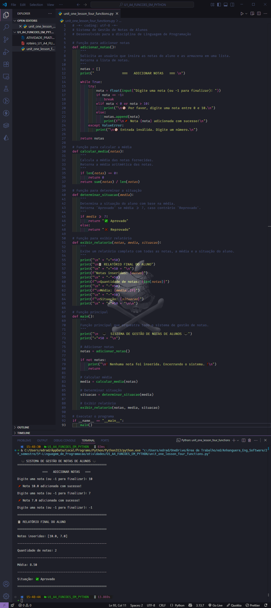
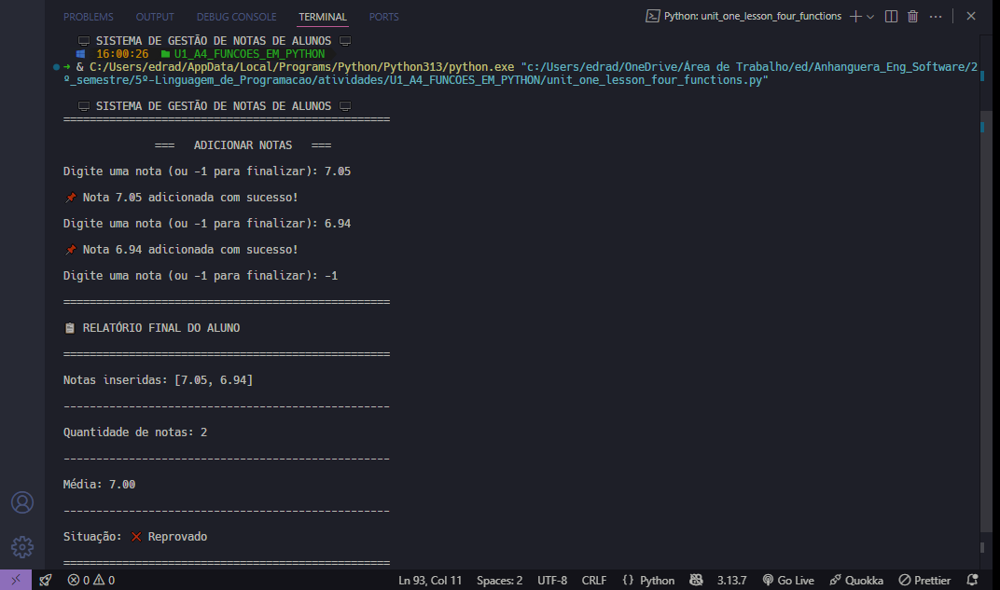
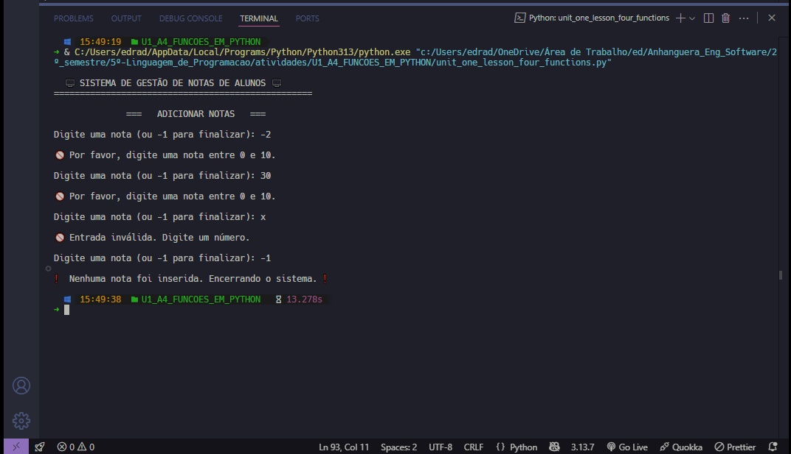

 <p align="center">
    
  </p>

# Projeto - Atividade Prática: Funções em Python

## Disciplina : Linguagem de Programação

### Unidade 1 – Aula 4

Ministrado por _Profº Anderson I. S. Abreu_.

<br>

Abaixo segue o resultado do projeto concluído:

<br>

> 🎯 Objetivo da Atividade:
>
> - Compreender a importância das estruturas condicionais, de repetição e funções.
> - Aplicar funções, listas e estruturas de controle em um cenário realista.
> - Desenvolver um sistema simples de gestão de notas de alunos com entrada de dados, cálculo de média, determinação da situação (aprovado / reprovado) e exibição de relatório.

<br>

### 🧩 Features

- Cadastro de notas do aluno (quantidade variável definida pelo usuário).
- Armazenamento das notas em uma lista.
- Cálculo automático da média aritmética.
- Determinação da situação do aluno (Aprovado ≥ 7.0 | Reprovado < 7.0).
- Exibição de relatório completo com todas as notas, média e situação.
- Validação básica de entrada (notas entre 0 e 10).

---

<table align="center">
  <tr>
    <td align="center">
      <a href="./images/result_activity_1.png">
        
      </a>
    </td>
    <td align="center">
      <a href="./images/result_activity_2.png">
        
      </a>
      <br>
      <br>
      <a href="./images/result_activity_3.png">
        
      </a>
    </td>
  </tr>
</table>

---

### 📚 Pré-requisitos

- [ ] Antes de iniciar este projeto, você deve ter conhecimento básico nas seguintes áreas:

- **Lógica de Programação :** Variáveis, entrada/saída de dados, estruturas condicionais e de repetição.
- **Python Básico :** Sintaxe da linguagem, tipos de dados, listas, funções e módulos.
- **Estruturas de Controle :** Uso de `if/elif/else`, `while` e `for`.
- **Funções em Python :** Definição de funções com `def`, parâmetros, retorno de valores e escopo de variáveis.
- **Manipulação de Listas :** Adição, iteração e cálculo de soma/len para média.

---

### 🛠️ Tecnologias Utilizadas

A Atvidade foi desenvolvida utilizando:

[](https://www.python.org/)&nbsp;&nbsp;&nbsp;&nbsp;&nbsp;&nbsp;[](https://colab.research.google.com/)&nbsp;&nbsp;&nbsp;&nbsp;&nbsp;&nbsp;[](https://code.visualstudio.com/)

---

### 📂 Estrutura do Projeto

```bash
U1_A4_FUNCOES_EM_PYTHON/
├── images/
│   ├── logo_python.png
│   ├── logo_python2.png
│   ├── mini_logo_vscode.png
│   ├── result_activity_1.png
│   └── result_activity_2.png
│   └── result_activity_3.png
├── src/
│   └── unit_one_lesson_four_functions.py    # Código principal da atividade
├── ATIVIDADE_PRATICA_U1_A4_FUNCOES_EM_PYTHON.pdf
├── README.md                                # Este arquivo
└── roteiro_U1_A4_FUNCOES_EM_PYTHON.pdf
```

---

### ⚙️ Configuração e Execução

- [ ] &nbsp;&nbsp;&nbsp;Pré-requisitos:

✔️ - Python 3.6+ ou Google Colab.

- [ ] &nbsp;&nbsp;&nbsp;Para rodar localmente (opcional) :

```bash
cd U1_A4_FUNCOES_EM_PYTHON/src
python unit_one_lesson_four_functions.py
```

<br>

- [x] &nbsp;&nbsp;&nbsp;Forma recomendada (conforme roteiro da disciplina) ➡ Abra o Google Colab, crie um novo notebook e cole o conteúdo de `unit_one_lesson_four_functions.py `.

---

### 🔬 Testes Realizados

✔️ - Testes manuais :

- [x] &nbsp;&nbsp;&nbsp;Cadastro de 3, 4 e 5 notas com valores válidos.
- [x] &nbsp;&nbsp;&nbsp;Cálculo correto da média em diferentes cenários.
- [x] &nbsp;&nbsp;&nbsp;Situação "Aprovado" quando média ≥ 7.0.
- [x] &nbsp;&nbsp;&nbsp;Situação "Reprovado" quando média < 7.0.
- [x] &nbsp;&nbsp;&nbsp;Validação de notas fora do intervalo 0–10.
- [x] &nbsp;&nbsp;&nbsp;Teste com aluno na média exata (7.0).

---

### 🧠 Habilidades Desenvolvidas

✔️ - Ao concluir esta atividade, você terá adquirido as seguintes habilidades e sub-habilidades :

- Criação e utilização de funções reutilizáveis em Python.
- Manipulação de listas para armazenamento dinâmico de dados.
- Uso de condicionais para tomada de decisão (aprovado/reprovado).
- Formatação de saída com f-strings e alinhamento.
- Validação de entrada do usuário.
- Estruturação limpa e comentada do código.
- Working with JSON data structures for item representation.
- Boas práticas de organização e documentação.

---

### 📜 Licença

Por se tratar de um projeto de caráter exclusivamente acadêmico, desenvolvido como atividade prática da disciplina de Linguagem de Programação, ainda não foi atribuída uma licença formal de software (como MIT, GPL ou outra).

O código tem finalidade educativa e de portfólio estudantil, sendo destinado apenas ao aprendizado e à avaliação no âmbito da faculdade. Caso deseje reutilizar ou adaptar o material para fins didáticos, sinta-se à vontade — apenas mantenha a referência ao autor original e ao contexto acadêmico.

---

<h4 align="center">
  👨‍💻 Desenvolvido por 
<h4/>
<br>

<table align="center">
  <tr>
    <td align="center">
      <a href="https://www.linkedin.com/in/edmar-radanovis/">
        <br>
        <sub><b>Edmar Radanovis</b></sub><br>
        <sub>Desenvolvedor Full Stack &nbsp;&</sub><br>
        <sub>Bacharelando em</sub><br>
        <sub>Engenharia de Software</sub>
      </a>
    </td>
    <td align="center">
      <a href="https://edwebdev.vercel.app/">
        <br>
        <sub><b>Ed Web Dev</b></sub><br>
      </a>
    </td>
  </tr>
</table>
<br>
<br>

[⬆ Voltar ao topo](#projeto---atividade-prática-funções-em-python)
