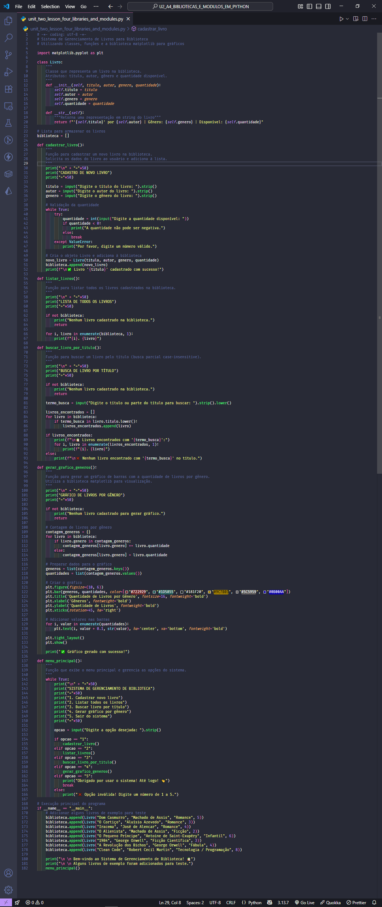
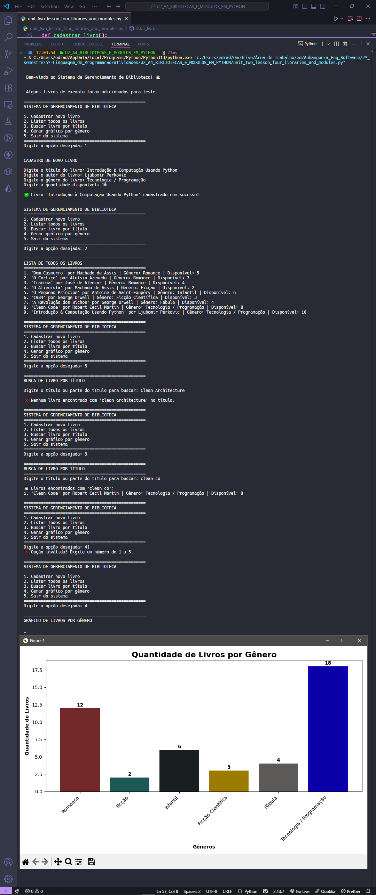

  <p align="center">
    
  </p>

# Projeto - Atividade Prática: Bibliotecas e Módulos em Python

## Disciplina : Linguagem de Programação

### Unidade 2 – Aula 4

Ministrado por _Profº Anderson I. S. Abreu_.

<br>

Abaixo segue o resultado do projeto concluído:

<br>

> 🎯 Objetivo da Atividade:
>
> - Compreender a importância dos `recursos` de **_[Python](https://www.python.org/)_** como `bibliotecas` e `módulos`.
> - Aplicar `Programação Orientada a Objetos` (POO) com classes e métodos em um cenário realista.
> - Desenvolver um `sistema de gerenciamento de biblioteca` com cadastro, busca e relatórios.
> - Utilizar a biblioteca **_[Matplotlib](https://matplotlib.org/)_** para geração de gráficos e visualização de dados.

<br>

### 🧩 Features

- Definição de classe **Livro** com atributos: título, autor, gênero e quantidade.
- Cadastro de novos livros no sistema da biblioteca.
- Listagem completa de todos os livros disponíveis.
- Busca inteligente de livros por título.
- Geração de gráfico de quantidade de livros por gênero.
- Interface intuitiva no Google Colab para execução interativa.
- Validação de dados e tratamento de entradas.

---

<table align="center">
  <tr>
    <td align="center">
      <a href="./images/result_activity_1.png">
        
      </a>
    </td>
    <td align="center">
      <a href="./images/result_activity_2.png">
        
      </a>
    </td>
  </tr>
</table>
---

### 📚 Pré-requisitos

- [ ] Antes de iniciar este projeto, você deve ter conhecimento básico nas seguintes áreas:

- **Programação Orientada a Objetos:** Conceitos de classes, objetos, atributos e métodos.
- **Python Intermediário:** Sintaxe da linguagem, listas, dicionários e funções.
- **Estruturas de Dados:** Manipulação de listas e iteração com loops.
- **Bibliotecas Python:** Instalação e importação de módulos externos.
- **Google Colab:** Ambiente de desenvolvimento em nuvem para execução de código.

---

### 🛠️ Tecnologias Utilizadas

A Atividade foi desenvolvida utilizando:

[](https://www.python.org/)&nbsp;&nbsp;&nbsp;&nbsp;&nbsp;&nbsp;[](https://colab.research.google.com/)&nbsp;&nbsp;&nbsp;&nbsp;&nbsp;&nbsp;[](https://code.visualstudio.com/)&nbsp;&nbsp;&nbsp;&nbsp;&nbsp;&nbsp;[](https://matplotlib.org/)&nbsp;&nbsp;&nbsp;&nbsp;&nbsp;&nbsp;[](https://pt.wikipedia.org/wiki/Programação_orientada_a_objetos)

---

### 📂 Estrutura do Projeto

```bash
U2_A4_BIBLIOTECAS_E_MODULOS_EM_PYTHON/
├── images/
│   ├── result_activity_1.png
│   └── result_activity_2.png
├── src/
│   └── unit_two_lesson_four_libraries_and_modules.py             # Código principal da atividade
├── ATIVIDADE_PRATICA_U2_A4_BIBLIOTECAS_E_MODULOS_EM_PYTHON.pdf
├── README.md                                                     # Este arquivo
└── roteiro_U2_A4_BIBLIOTECAS_E_MODULOS_EM_PYTHON.pdf
```

---

### ⚙️ Configuração e Execução

- [ ] &nbsp;&nbsp;&nbsp;Pré-requisitos:

✔️ - Python 3.6+ ou Google Colab.

<br>

- [ ] &nbsp;&nbsp;&nbsp;Acesso à internet para instalação da Matplotlib.
- Para rodar localmente (opcional):

```bash
cd U2_A4_BIBLIOTECAS_E_MODULOS_EM_PYTHON/src
python unit_two_lesson_four_libraries_and_modules.py
```

<br>

- [x] &nbsp;&nbsp;&nbsp;Forma recomendada (conforme roteiro da disciplina) ➡ Abra o Google Colab, crie um novo notebook e implemente o sistema seguindo os passos:

```python
      # Passo 1: Instalar e importar bibliotecas
!pip install matplotlib
import matplotlib.pyplot as plt

      # Passo 2: Definir classe Livro
class Livro:
    def __init__(self, titulo, autor, genero, quantidade):
        self.titulo = titulo
        self.autor = autor
        self.genero = genero
        self.quantidade = quantidade

    def __str__(self):
        return f"'{self.titulo}' por {self.autor} | Gênero: {self.genero} | Disponível: {self.quantidade}"

      # Passo 3: Implementar funções do sistema
biblioteca = []

def cadastrar_livro(titulo, autor, genero, quantidade):
    # Implementação da função
    pass

def listar_livros():
    # Implementação da função
    pass

def buscar_livro(titulo):
    # Implementação da função
    pass

def gerar_grafico_generos():
    # Implementação da função
    pass
```

---

### 🔬 Testes Realizados

✔️ - Testes manuais :

- [x] &nbsp;&nbsp;&nbsp;Cadastro de múltiplos livros com diferentes gêneros.
- [x] &nbsp;&nbsp;&nbsp;Listagem completa de todos os livros cadastrados.
- [x] &nbsp;&nbsp;&nbsp;Busca por título (casos: encontrado e não encontrado).
- [x] &nbsp;&nbsp;&nbsp;Geração correta do gráfico de livros por gênero.
- [x] &nbsp;&nbsp;&nbsp;Validação de entradas e tratamento de dados.
- [x] &nbsp;&nbsp;&nbsp;Teste de instalação e importação da Matplotlib.

---

### 🧠 Habilidades Desenvolvidas

✔️ - Ao concluir esta atividade, você terá adquirido as seguintes habilidades e sub-habilidades :

- Criação e utilização de classes em Python (Programação Orientada a Objetos).
- Implementação de sistemas de gerenciamento de dados com listas e objetos.
- Manipulação e visualização de dados com a biblioteca Matplotlib.
- Desenvolvimento de funções modulares para operações específicas.
- Habilidade em buscar e filtrar dados em estruturas complexas.
- Geração de relatórios visuais com gráficos personalizados.
- Boas práticas de organização de código e documentação.
- Experiência com ambientes de desenvolvimento em nuvem (Google Colab).

---

### 📜 Licença

Por se tratar de um projeto de caráter exclusivamente acadêmico, desenvolvido como atividade prática da disciplina de Linguagem de Programação, ainda não foi atribuída uma licença formal de software (como MIT, GPL ou outra).

O código tem finalidade educativa e de portfólio estudantil, sendo destinado apenas ao aprendizado e à avaliação no âmbito da faculdade. Caso deseje reutilizar ou adaptar o material para fins didáticos, sinta-se à vontade — apenas mantenha a referência ao autor original e ao contexto acadêmico.

---

<h4 align="center">
  👨‍💻 Desenvolvido por 
<h4/>
<br>

<table align="center">
  <tr>
    <td align="center">
      <a href="https://www.linkedin.com/in/edmar-radanovis/">
        <br>
        <sub><b>Edmar Radanovis</b></sub><br>
        <sub>Desenvolvedor Full Stack &nbsp;&</sub><br>
        <sub>Bacharelando em</sub><br>
        <sub>Engenharia de Software</sub>
      </a>
    </td>
    <td align="center">
      <a href="https://edwebdev.vercel.app/">
        <br>
        <sub><b>Ed Web Dev</b></sub><br>
      </a>
    </td>
  </tr>
</table>
<br>
<br>

[⬆ Voltar ao topo](#projeto---atividade-prática-bibliotecas-e-módulos-em-python)
