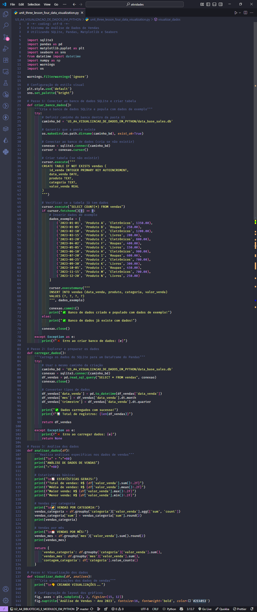
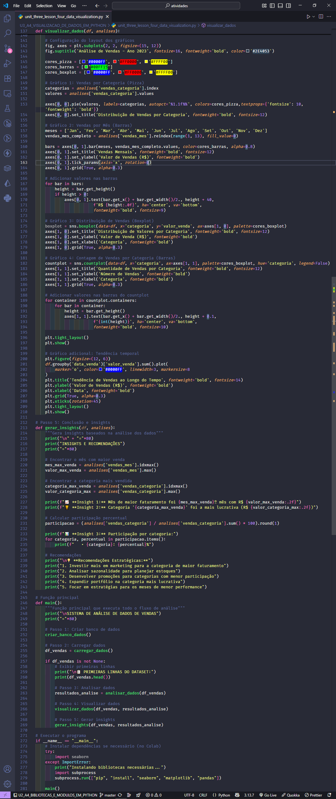
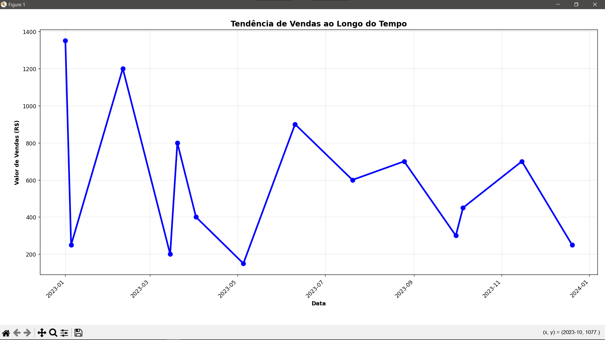
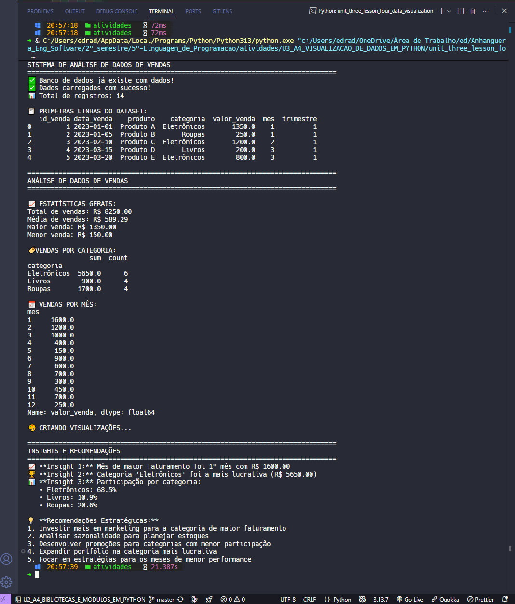

  <p align="center">
    
  </p>

# Projeto - Atividade Prática: Análise de Dados em Python

## Disciplina : Linguagem de Programação

### Unidade 3 – Aula 4

Ministrado por _Profº Anderson I. S. Abreu_.

<br>

Abaixo segue o resultado do projeto concluído:

<br>

> 🎯 Objetivo da Atividade:
>
> - Compreender como utilizar **_[Python](https://www.python.org/)_** para `análise` de dados em cenários reais de negócios.
> - Aplicar técnicas de `tratamento` e `extração` de informações de _bancos de dados_.
> - Desenvolver um <u>sistema completo</u> de análise de vendas com **_[SQLite](https://sqlite.org/)_** , **_[Pandas](https://pandas.pydata.org/)_** e visualizações.
> - Utilizar **_[Matplotlib](https://matplotlib.org/)_** e **_[Seaborn](https://seaborn.pydata.org/)_** para criar visualizações profissionais que gerem insights.
>   <br>

### 🧩 Features

- Conexão e manipulação de banco de dados **SQLite** com Python.
- Criação de tabelas e inserção de dados de vendas fictícias.
- Exploração e preparação de dados utilizando **Pandas DataFrame**.
- Análise de vendas por categoria, período e produtos.
- Geração de **visualizações profissionais** com Matplotlib e Seaborn.
- Extração de **insights estratégicos** para tomada de decisão.
- Relatório completo de análise de desempenho de vendas.

---

<table align="center">
  <tr>
    <td align="center">
      <a href="./images/result_activity_1.png">
        
      </a>
      <br>
      <br>
      <a href="./images/graphic_1.png">
        
      </a>
    </td>
    <td align="center">
      <a href="./images/result_activity_2.png">
        
      </a>
      <br>
      <br>
      <a href="./images/graphic_2.png">
        
      </a>
    </td>
    <td align="center">
      <a href="./images/result_activity_3.png">
        
      </a>
    </td>
  </tr>
</table>

---

### 📚 Pré-requisitos

- [ ] Antes de iniciar este projeto, você deve ter conhecimento básico nas seguintes áreas:

- **Python Intermediário:** Sintaxe da linguagem, estruturas de dados e funções.
- **Pandas Básico:** Manipulação de DataFrames, leitura e filtragem de dados.
- **Banco de Dados:** Conceitos básicos de `SQL` e operações `CRUD`.
- **Estatística Descritiva:** Média, soma, agrupamento e análise de tendências.
- **Google Colab:** Ambiente de desenvolvimento em nuvem para execução de código.

---

### 🛠️ Tecnologias Utilizadas

A Atividade foi desenvolvida utilizando:

[](https://www.python.org/)&nbsp;&nbsp;&nbsp;&nbsp;&nbsp;&nbsp;[](https://colab.research.google.com/)&nbsp;&nbsp;&nbsp;&nbsp;&nbsp;&nbsp;[](https://code.visualstudio.com/)&nbsp;&nbsp;&nbsp;&nbsp;&nbsp;&nbsp;[](https://pandas.pydata.org/)&nbsp;&nbsp;&nbsp;&nbsp;&nbsp;&nbsp;[](https://matplotlib.org/)&nbsp;&nbsp;&nbsp;&nbsp;&nbsp;&nbsp;[](https://seaborn.pydata.org/)&nbsp;&nbsp;&nbsp;&nbsp;&nbsp;&nbsp;[](https://www.sqlite.org/)

---

### 📂 Estrutura do Projeto

```bash
U1_A4_FUNCOES_EM_PYTHON/
├── images/
│   ├── graphic_1.png
│   ├── graphic_2.png
│   ├── mini_logo_seaborn.png
│   ├── result_activity_1.png
│   ├── result_activity_2.png
│   └── result_activity_3.png
├── src/
│   ├── data_base_sales.db
│   └── unit_three_lesson_four_data_visualization.py   # Código principal da atividade
├── ATIVIDADE_PRATICA_U3_A4_VISUALIZACAO_DE_DADOS_COM_PYTHON.pdf
├── README.md                                          # Este arquivo
└── roteiro_U3_A4_VISUALIZACAO_DE_DADOS_EM_PYTHON.pdf
```

---

### ⚙️ Configuração e Execução

- [ ] &nbsp;&nbsp;&nbsp;Pré-requisitos:

✔️ - Python 3.6+ ou Google Colab.

<br>

- [ ] &nbsp;&nbsp;&nbsp;Acesso à internet para instalação da Matplotlib.
- Para rodar localmente (opcional):

```bash
cd U3_A4_VISUALIZACAO_DE_DADOS_EM_PYTHON/src
python unit_three_lesson_four_data_visualization.py
```

<br>

- [x] &nbsp;&nbsp;&nbsp;Forma recomendada (conforme roteiro da disciplina) ➡ Abra o Google Colab, crie um novo notebook e implemente o sistema seguindo os passos:

```python
# Passo 1: Instalar e importar bibliotecas
!pip install pandas matplotlib seaborn
import sqlite3
import pandas as pd
import matplotlib.pyplot as plt
import seaborn as sns

# Passo 2: Conectar ao banco de dados SQLite
conexao = sqlite3.connect('dados_vendas.db')
cursor = conexao.cursor()

# Passo 3: Criar tabela e inserir dados
cursor.execute('''
CREATE TABLE IF NOT EXISTS vendas1 (
    id_venda INTEGER PRIMARY KEY AUTOINCREMENT,
    data_venda DATE,
    produto TEXT,
    categoria TEXT,
    valor_venda REAL
)
''')

# Passo 4: Carregar dados no Pandas DataFrame
df_vendas = pd.read_sql_query("SELECT * FROM vendas1", conexao)

# Passo 5: Análise exploratória e visualizações
# (Implementar análises específicas do roteiro)
```

---

### 🔬 Testes Realizados

✔️ - Testes manuais :

- [x] &nbsp;&nbsp;&nbsp;Conexão bem-sucedida com banco de dados SQLite.
- [x] &nbsp;&nbsp;&nbsp;Criação e população da tabela de vendas.
- [x] &nbsp;&nbsp;&nbsp;Carregamento correto dos dados no DataFrame Pandas.
- [x] &nbsp;&nbsp;&nbsp;Análise exploratória (estatísticas descritivas, agrupamentos).
- [x] &nbsp;&nbsp;&nbsp;Geração de visualizações com Matplotlib e Seaborn.
- [x] &nbsp;&nbsp;&nbsp;Extração de insights sobre categorias e períodos de vendas.
- [x] &nbsp;&nbsp;&nbsp;Validação de cálculos de total de vendas e médias.

---

### 🧠 Habilidades Desenvolvidas

✔️ - Ao concluir esta atividade, você terá adquirido as seguintes habilidades e sub-habilidades :

- Conexão e manipulação de bancos de dados SQLite com Python.
- Manipulação avançada de DataFrames com biblioteca Pandas.
- Criação de visualizações profissionais com Matplotlib e Seaborn.
- Análise exploratória de dados para identificação de padrões.
- Extração de insights estratégicos de dados de vendas.
- Desenvolvimento de relatórios analíticos completos.
- Habilidade em trabalhar com datas e agrupamentos temporais.
- Capacidade de apresentar dados de forma clara e visualmente atraente.

---

### 📜 Licença

Por se tratar de um projeto de caráter exclusivamente acadêmico, desenvolvido como atividade prática da disciplina de Linguagem de Programação, ainda não foi atribuída uma licença formal de software (como MIT, GPL ou outra).

O código tem finalidade educativa e de portfólio estudantil, sendo destinado apenas ao aprendizado e à avaliação no âmbito da faculdade. Caso deseje reutilizar ou adaptar o material para fins didáticos, sinta-se à vontade — apenas mantenha a referência ao autor original e ao contexto acadêmico.

---

<h4 align="center">
  👨‍💻 Desenvolvido por 
<h4/>
<br>

<table align="center">
  <tr>
    <td align="center">
      <a href="https://www.linkedin.com/in/edmar-radanovis/">
        <br>
        <sub><b>Edmar Radanovis</b></sub><br>
        <sub>Desenvolvedor Full Stack &nbsp;&</sub><br>
        <sub>Bacharelando em</sub><br>
        <sub>Engenharia de Software</sub>
      </a>
    </td>
    <td align="center">
      <a href="https://edwebdev.vercel.app/">
        <br>
        <sub><b>Ed Web Dev</b></sub><br>
      </a>
    </td>
  </tr>
</table>
<br>
<br>

[⬆ Voltar ao topo](#projeto---atividade-prática-análise-de-dados-em-python)
