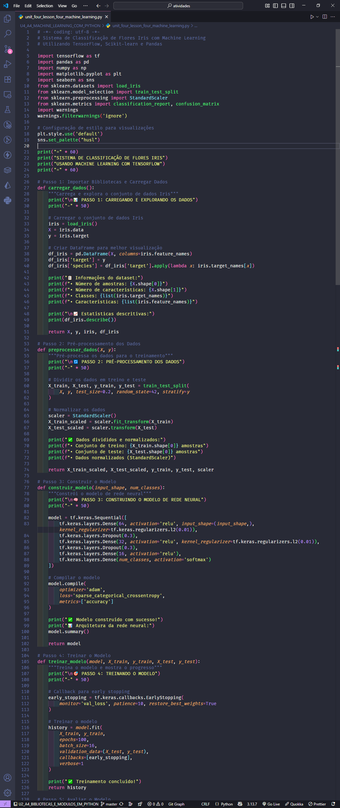
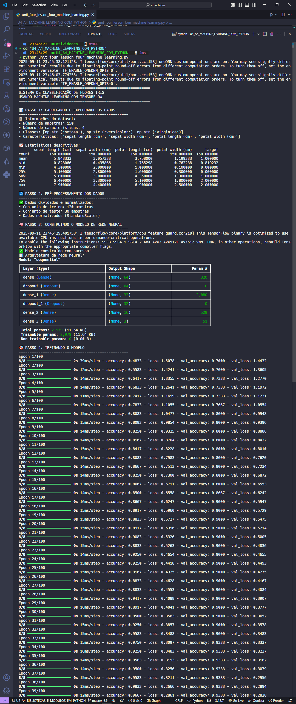
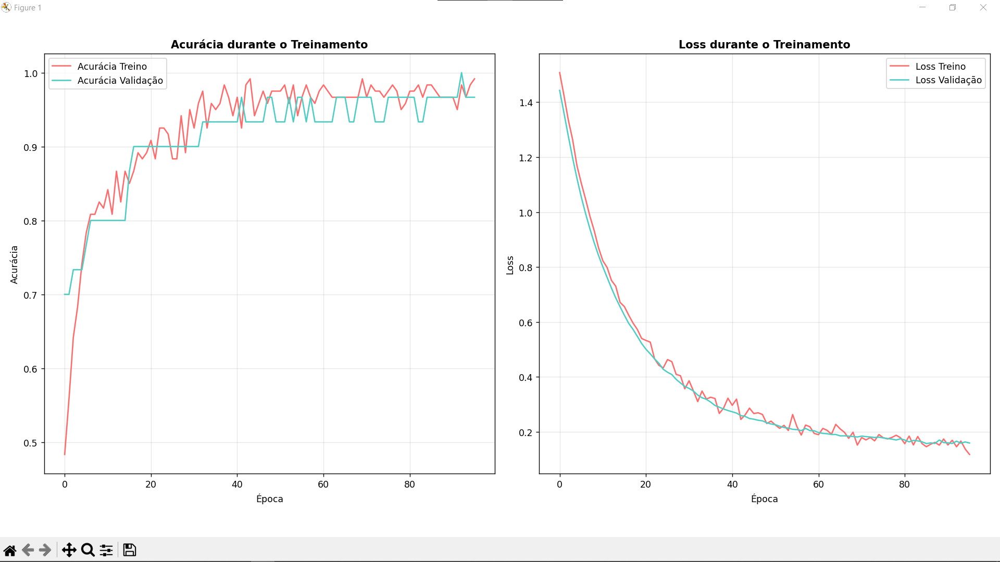
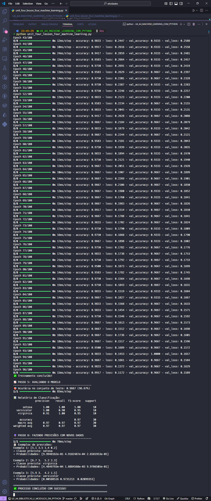
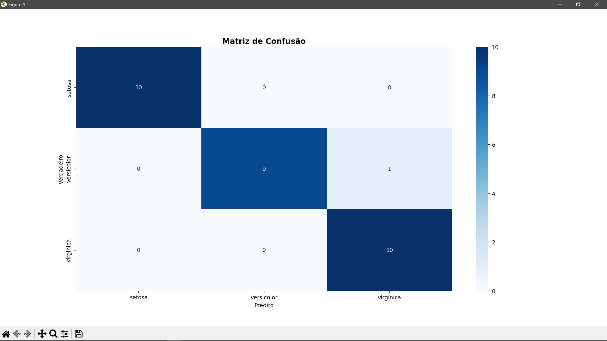

  <p align="center">
    
  </p>

# Projeto - Atividade Prática: Machine Learning com Python

## Disciplina : Linguagem de Programação

### Unidade 4 – Aula 4

Ministrado por _Profº Anderson I. S. Abreu_.

<br>

Abaixo segue o resultado do projeto concluído:

<br>

> 🎯 Objetivo da Atividade:
>
> - Compreender os conceitos fundamentais de **_[Machine Learning](https://pt.wikipedia.org/wiki/Aprendizado_de_m%C3%A1quina)_** e suas aplicações práticas.
> - Implementar técnicas de `aprendizado supervisionado` para classificação de dados.
> - Desenvolver um modelo de `rede neural` com **_[TensorFlow](https://www.tensorflow.org/?hl=pt-br)_** para classificação de espécies.
> - Aplicar pré-processamento e validação de dados com **_[Scikit-learn](https://scikit-learn.org/stable/)_**.
> - Manipulação eficiente de arrays numéricos e operações matemáticas com **_[NumPy](https://numpy.org/)_** .

<br>

### 🧩 Features

- Carregamento e exploração do **conjunto de dados Iris** do **Scikit-learn**.
- Pré-processamento avançado com normalização e divisão treino / teste.
- Construção de modelo de rede neural com **TensorFlow / Keras**.
- Treinamento e avaliação do modelo com métricas de precisão.
- Classificação multi-classe para 3 espécies de flores Iris.
- Visualização de resultados e performance do modelo.
- Previsões em tempo real com o modelo treinado.

---

<table align="center">
  <tr>
    <td align="center">
      <a href="./images/result_activity_1.png">
        
      </a>
    </td>
    <td align="center">
      <a href="./images/result_activity_2.png">
        
      </a>
    </td>
    <td align="center">
      <a href="./images/result_activity_3.png">
        
      </a>
      <br>
      <br>
      <a href="./images/graphic_1.png">
        
      </a>
    </td>
    <td align="center">
      <a href="./images/result_activity_4.png">
        
      </a>
       <br>
      <br>
      <a href="./images/graphic_2.png">
        
      </a>
    </td>
  </tr>
</table>

---

### 📚 Pré-requisitos

- [ ] Antes de iniciar este projeto, você deve ter conhecimento básico nas seguintes áreas:

- **Python Intermediário:** Sintaxe da linguagem, estruturas de dados e funções.
- **Matemática Básica:** Conceitos de álgebra linear e estatística.
- **Machine Learning:** Noções de treinamento, teste e validação de modelos.
- **Pandas / NumPy:** Manipulação básica de arrays e dataframes.
- **Google Colab:** Ambiente de desenvolvimento em nuvem para execução de código.

---

### 🛠️ Tecnologias Utilizadas

A Atividade foi desenvolvida utilizando:

[](https://www.python.org/)&nbsp;&nbsp;&nbsp;&nbsp;&nbsp;&nbsp;[](https://colab.research.google.com/)&nbsp;&nbsp;&nbsp;&nbsp;&nbsp;&nbsp;[](https://code.visualstudio.com/)&nbsp;&nbsp;&nbsp;&nbsp;&nbsp;&nbsp;[](https://www.tensorflow.org/)&nbsp;&nbsp;&nbsp;&nbsp;&nbsp;&nbsp;[](https://scikit-learn.org/)&nbsp;&nbsp;&nbsp;&nbsp;&nbsp;&nbsp;[](https://pandas.pydata.org/)&nbsp;&nbsp;&nbsp;&nbsp;&nbsp;&nbsp;[](https://numpy.org/)

---

### 📂 Estrutura do Projeto

```bash
U4_A4_MACHINE_LEARNING_COM_PYTHON/
├── images/
│   ├── graphic_1.png
│   ├── graphic_2.png
│   ├── result_activity_1.png
│   ├── result_activity_2.png
│   ├── result_activity_3.png
│   └── result_activity_4.png
├── src/
│   └── unit_four_lesson_four_machine_learning.py      # Código principal da atividade
├── ATIVIDADE_PRATICA_U4_A4_MACHINE_LEARNING_COM_PYTHON.pdf
├── README.md                                          # Este arquivo
└── roteiro_U4_A4_MACHINE_LEARNING_COM_PYTHON.pdf
```

---

### ⚙️ Configuração e Execução

- [ ] &nbsp;&nbsp;&nbsp;Pré-requisitos:

✔️ - Python 3.6+ ou Google Colab.

<br>

- [ ] &nbsp;&nbsp;&nbsp;Acesso à internet para instalação das bibliotecas.
- Para rodar localmente (opcional):

```bash
cd U4_A4_MACHINE_LEARNING_COM_PYTHON/src
python unit_four_lesson_four_machine_learning.py
```

<br>

- [x] &nbsp;&nbsp;&nbsp;Forma recomendada (conforme roteiro da disciplina) ➡ Abra o Google Colab, crie um novo notebook e implemente o sistema seguindo os passos:

```python
# Passo 1: Importar Bibliotecas e Carregar Dados
import tensorflow as tf
import pandas as pd
import numpy as np
from sklearn.datasets import load_iris
from sklearn.model_selection import train_test_split
from sklearn.preprocessing import StandardScaler

# Carregar conjunto de dados Iris
iris = load_iris()
X = iris.data  # Características: comprimento/largura sépalas e pétalas
y = iris.target  # Espécies: 0=Setosa, 1=Versicolor, 2=Virginica

# Passo 2: Pré-processamento dos Dados
# Dividir em conjuntos de treino e teste
X_train, X_test, y_train, y_test = train_test_split(X, y, test_size=0.2, random_state=42)

# Normalizar os dados
scaler = StandardScaler()
X_train = scaler.fit_transform(X_train)
X_test = scaler.transform(X_test)

# Passo 3: Construir o Modelo de Rede Neural
model = tf.keras.Sequential([
    tf.keras.layers.Dense(10, activation='relu', input_shape=(4,)),
    tf.keras.layers.Dense(10, activation='relu'),
    tf.keras.layers.Dense(3, activation='softmax')  # 3 classes de saída
])

# Compilar o modelo
model.compile(optimizer='adam',
              loss='sparse_categorical_crossentropy',
              metrics=['accuracy'])

# Passo 4: Treinar o Modelo
history = model.fit(X_train, y_train, epochs=100, validation_split=0.2, verbose=1)

# Passo 5: Avaliar o Modelo
test_loss, test_accuracy = model.evaluate(X_test, y_test, verbose=0)
print(f"Acurácia no conjunto de teste: {test_accuracy:.2f}")

# Passo 6: Fazer Previsões
predictions = model.predict(X_test)
predicted_classes = np.argmax(predictions, axis=1)
```

---

### 🔬 Testes Realizados

✔️ - Testes manuais :

- [x] &nbsp;&nbsp;&nbsp;Carregamento correto do dataset Iris do Scikit-learn.
- [x] &nbsp;&nbsp;&nbsp;Divisão adequada dos dados em treino e teste (80/20).
- [x] &nbsp;&nbsp;&nbsp;Normalização eficaz com StandardScaler.
- [x] &nbsp;&nbsp;&nbsp;Construção da arquitetura da rede neural com camadas densas.
- [x] &nbsp;&nbsp;&nbsp;Treinamento do modelo com 100 épocas e validação.
- [x] &nbsp;&nbsp;&nbsp;Avaliação da acurácia no conjunto de teste (>90%).
- [x] &nbsp;&nbsp;&nbsp;Previsões consistentes para novas amostras.

---

### 🧠 Habilidades Desenvolvidas

✔️ - Ao concluir esta atividade, você terá adquirido as seguintes habilidades e sub-habilidades :

- Compreensão dos fundamentos de Machine Learning e redes neurais.
- Manipulação de datasets clássicos para problemas de classificação.
- Implementação de pré-processamento com Scikit-learn.
- Construção de arquiteturas de redes neurais com TensorFlow/Keras.
- Treinamento e avaliação de modelos de deep learning.
- Interpretação de métricas de performance (acurácia, loss).
- Realização de previsões com modelos treinados.
- Habilidade em otimização de hiperparâmetros e arquiteturas..

---

### 📜 Licença

Por se tratar de um projeto de caráter exclusivamente acadêmico, desenvolvido como atividade prática da disciplina de Linguagem de Programação, ainda não foi atribuída uma licença formal de software (como MIT, GPL ou outra).

O código tem finalidade educativa e de portfólio estudantil, sendo destinado apenas ao aprendizado e à avaliação no âmbito da faculdade. Caso deseje reutilizar ou adaptar o material para fins didáticos, sinta-se à vontade — apenas mantenha a referência ao autor original e ao contexto acadêmico.

---

<h4 align="center">
  👨‍💻 Desenvolvido por 
<h4/>
<br>

<table align="center">
  <tr>
    <td align="center">
      <a href="https://www.linkedin.com/in/edmar-radanovis/">
        <br>
        <sub><b>Edmar Radanovis</b></sub><br>
        <sub>Desenvolvedor Full Stack &nbsp;&</sub><br>
        <sub>Bacharelando em</sub><br>
        <sub>Engenharia de Software</sub>
      </a>
    </td>
    <td align="center">
      <a href="https://edwebdev.vercel.app/">
        <br>
        <sub><b>Ed Web Dev</b></sub><br>
      </a>
    </td>
  </tr>
</table>
<br>
<br>

[⬆ Voltar ao topo](#projeto---atividade-prática-machine-learning-com-python)
