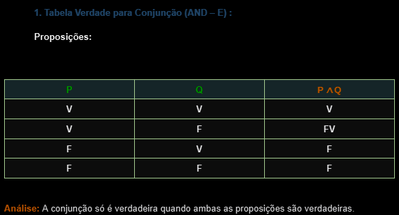
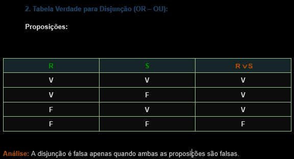
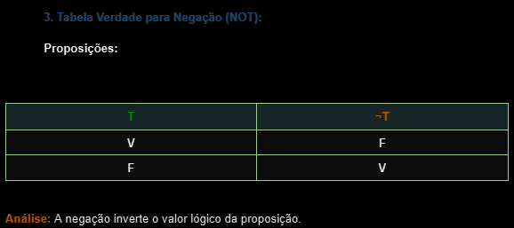
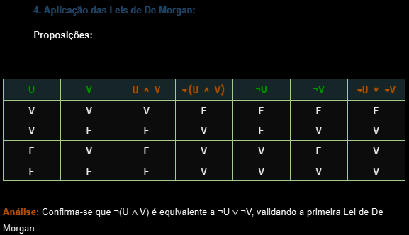
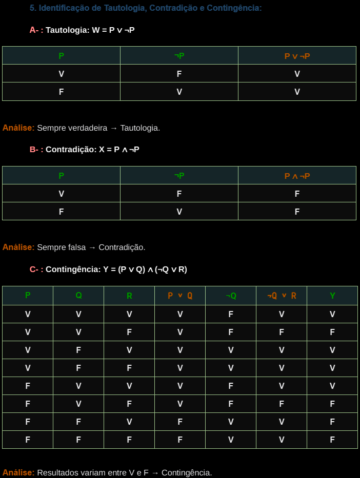

  

    
  

# Atividade Prática: Aplicações da Tabela Verdade

## Disciplina: Lógica e Matemática Computacional

### Unidade 4 – Aula 3

Ministrado por _Profº Me. Rômulo de Almeida Neves_.

 

Abaixo segue o resultado do projeto concluído:

 

> 🎯 Objetivo da Atividade:
>
> - Compreender os fundamentos da `tabela verdade` e sua aplicação em lógica proposicional.
> - Desenvolver habilidades na `construção` e `interpretação` de tabelas verdade.
> - Aplicar a tabela verdade para resolver problemas envolvendo `conectivos lógicos` ➡ **AND** , **OR** , **Negação**.
> - Explorar a aplicação das `leis de _De Morgan_` e conceitos de `tautologia` , `contradição` e `contingência`.

 

### 🧩 Features

- Construção de tabelas verdade para conectivos lógicos básicos.
- Aplicação prática das leis de De Morgan.
- Identificação e análise de tautologias, contradições e contingências.
- Desenvolvimento do raciocínio lógico-matemático.
- Análise comparativa entre diferentes proposições lógicas.

---

<table align="center">
  <tr>
    <td align="center">
      
       
       
      
    </td>
    </td>
    <td align="center">
      
       
       
      
    </td>
    <td align="center">
    </td>
    <td align="center">
      
    </td>
  </tr>
</table>

---

### 📚 Pré-requisitos

- [ ] Antes de iniciar este projeto, você deve ter conhecimento básico nas seguintes áreas:

- **Lógica Proposicional:** Conceitos básicos de proposições e valores lógicos.
- **Conectivos Lógicos:** Compreensão dos operadores AND, OR, NOT.
- **Tabela Verdade:** Noções básicas de construção e interpretação.
- **Planilhas Eletrônicas:** Conhecimento básico de Excel ou Google Sheets (opcional).

---

### 🛠️ Tecnologias Utilizadas

A Atividade foi desenvolvida utilizando:

&nbsp;&nbsp;&nbsp;&nbsp;&nbsp;&nbsp;

---

### ⚙️ Configuração e Execução

- [ ] &nbsp;&nbsp;&nbsp;Pré-requisitos:

✔️ - Acesso a software de lógica proposicional ou planilhas eletrônicas.

---

### 🔬 Testes Realizados

✔️ - Verificações lógicas :

- [x] &nbsp;&nbsp;&nbsp;Tabela AND retorna V apenas quando ambas proposições são V
- [x] &nbsp;&nbsp;&nbsp;Tabela OR retorna V quando pelo menos uma proposição é V
- [x] &nbsp;&nbsp;&nbsp;Negação inverte o valor lógico original
- [x] &nbsp;&nbsp;&nbsp;Leis de De Morgan aplicadas corretamente
- [x] &nbsp;&nbsp;&nbsp;Tautologia identificada (sempre V)
- [x] &nbsp;&nbsp;&nbsp;Contradição identificada (sempre F)
- [x] &nbsp;&nbsp;&nbsp;Contingência identificada (valores mistos)

---

### 🧠 Habilidades Desenvolvidas

✔️ - Ao concluir esta atividade, você terá adquirido as seguintes habilidades e sub-habilidades :

- Construção e interpretação de tabelas verdade para diferentes conectivos lógicos.
- Aplicação prática das leis de De Morgan em proposições lógicas.
- Identificação e análise de tautologias, contradições e contingências.
- Desenvolvimento do raciocínio lógico-matemático.
- Habilidade em analisar proposições compostas complexas.
- Capacidade de verificar equivalências lógicas.
- Competência em resolver problemas utilizando ferramentas lógicas formais.

---

### 📜 Licença

Por se tratar de um projeto de caráter exclusivamente acadêmico, desenvolvido como atividade prática da disciplina de Lógica e Matemática Computacional, ainda não foi atribuída uma licença formal.

O material tem finalidade educativa e de portfólio estudantil, sendo destinado apenas ao aprendizado e à avaliação no âmbito da faculdade. Caso deseje reutilizar ou adaptar o material para fins didáticos, sinta-se à vontade — apenas mantenha a referência ao autor original e ao contexto acadêmico.

---

<h4 align="center">
  👨‍💻 Desenvolvido por 
<h4/>
 

<table align="center">
  <tr>
    <td align="center">
      <a href="https://www.linkedin.com/in/edmar-radanovis/">
         
        <b>Edmar Radanovis</b> 
        Desenvolvedor Full Stack &nbsp;& 
        Bacharelando em 
        Engenharia de Software
      </a>
    </td>
    <td align="center">
      <a href="https://edwebdev.vercel.app/">
         
        <b>Ed Web Dev</b> 
      </a>
    </td>
  </tr>
</table>
 
 

[⬆ Voltar ao topo](#atividade-prática-aplicações-da-tabela-verdade)
