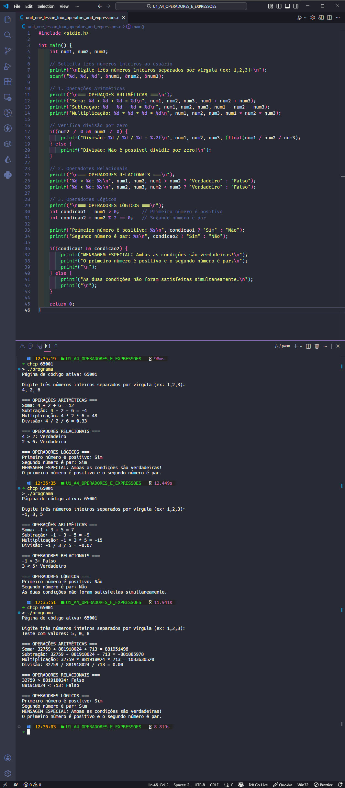

  <p align="center">
    
  </p>

# Projeto - Atividade Prática: Operadores e Expressões em C

## Disciplina: Algoritmos e Programação Estruturada

### Unidade 1 – Aula 4

Ministrado por _Dr. Gilberto Fernandes Junior_.

<br>

Abaixo segue o resultado do projeto concluído:

<br>

> 🎯 Objetivo da Atividade:
>
> - Compreender o funcionamento de `operadores aritméticos` , `relacionais` e `lógicos` na linguagem de programação **_[C](https://en.cppreference.com/)_**.
> - Aplicar **operadores** em `expressões condicionais ` e `matemáticas` em programas simples.
> - Desenvolver habilidades na **combinação de operadores** para criar expressões complexas.
> - Implementar `validações lógicas` baseadas em múltiplas condições.

<br>

### 🧩 Features

- Leitura e processamento de três números inteiros do usuário.
- Cálculos matemáticos completos (soma, subtração, multiplicação, divisão).
- Verificações relacionais (maior que, menor que).
- Validações lógicas combinadas (positivo E par).
- Sistema de mensagens condicionais baseado nas verificações.
- Interface simples e funcional via terminal.

---

<table align="center">
  <tr>
    <td align="center">
      <a href="./images/result_activity_1.png">
        
      </a>
    </td>
  </tr>  
</table>

---

### 📚 Pré-requisitos

- [ ] Antes de iniciar este projeto, você deve ter conhecimento básico nas seguintes áreas:

- **Linguagem C Básica:** Sintaxe, estrutura main, variáveis e tipos de dados
- **Entrada / Saída:** Comandos printf e scanf para interação com usuário
- **Operadores Matemáticos:** Conceitos básicos de aritmética
- **Lógica Booleana:** Noções de condições verdadeiro/falso
- **OnlineGDB:** Familiaridade com a plataforma online (opcional)

---

### 🛠️ Tecnologias Utilizadas

A Atividade foi desenvolvida utilizando:

[](https://en.cppreference.com/w/c/language)&nbsp;&nbsp;&nbsp;&nbsp;&nbsp;&nbsp;[](https://www.onlinegdb.com/)&nbsp;&nbsp;&nbsp;&nbsp;&nbsp;&nbsp;[](https://gcc.gnu.org/)&nbsp;&nbsp;&nbsp;&nbsp;&nbsp;&nbsp;[](https://code.visualstudio.com/)

---

### 📂 Estrutura do Projeto

```bash
U1_A4_OPERADORES_E_EXPRESSOES/
├── images/
│   ├── logo_linguagem_C_redondo.png
│   └── result_activity_1.png
├── src/
│   ├── programa.exe
│   └── unit_one_lesson_four_operators_and_expressions.c  # Código principal da atividade
├── ATIVIDADE_PRATICA_U1_A4_FUNDAMENTOS_DE_ALGORITMOS_E_PROGRAMACAO.pdf
├── README.md                                             # Este arquivo
└── roteiro_U1_A4_FUNDAMENTOS_DE_ALGORITMOS_E_PROGRAMACAO.pdf
```

---

### ⚙️ Configuração e Execução

- [ ] &nbsp;&nbsp;&nbsp;Pré-requisitos:

✔️ - Acesso ao OnlineGDB ou compilador C local.

<br>

- [x] &nbsp;&nbsp;&nbsp;Forma recomendada (conforme roteiro da disciplina) ➡ Acesse o OnlineGDB e siga os passos:

```c
// Passo 1: Acesse https://www.onlinegdb.com/
// Passo 2: Selecione "C" como linguagem
// Passo 3: Implemente o código base:

#include <stdio.h>

int main() {
    int num1, num2, num3;

    // Solicitar três números inteiros
    printf("Digite três números inteiros: ");
    scanf("%d %d %d", &num1, &num2, &num3);

    // Passo 4: Implementar operações aritméticas
    printf("\n=== OPERAÇÕES ARITMÉTICAS ===\n");
    printf("Soma: %d + %d + %d = %d\n", num1, num2, num3, num1 + num2 + num3);
    printf("Subtração: %d - %d - %d = %d\n", num1, num2, num3, num1 - num2 - num3);
    printf("Multiplicação: %d * %d * %d = %d\n", num1, num2, num3, num1 * num2 * num3);

    // Verificar divisão por zero
    if(num2 != 0 && num3 != 0) {
        printf("Divisão: %d / %d / %d = %.2f\n", num1, num2, num3, (float)num1 / num2 / num3);
    } else {
        printf("Divisão: Não é possível dividir por zero!\n");
    }

    // Passo 5: Implementar verificações relacionais
    printf("\n=== VERIFICAÇÕES RELACIONAIS ===\n");
    printf("%d > %d: %s\n", num1, num2, num1 > num2 ? "Verdadeiro" : "Falso");
    printf("%d < %d: %s\n", num2, num3, num2 < num3 ? "Verdadeiro" : "Falso");

    // Passo 6: Implementar verificações lógicas
    printf("\n=== VERIFICAÇÕES LÓGICAS ===\n");
    if(num1 > 0 && num2 % 2 == 0) {
        printf("✓ Condição atendida: Primeiro número é positivo E segundo é par!\n");
    } else {
        printf("✗ Condição não atendida\n");
    }

    return 0;
}
```

---

### 🔬 Testes Realizados

✔️ - Validações do programa :

- [x] &nbsp;&nbsp;&nbsp;Leitura correta de três números inteiros via scanf.
- [x] &nbsp;&nbsp;&nbsp;Cálculos aritméticos precisos (soma, subtração, multiplicação).
- [x] &nbsp;&nbsp;&nbsp;Tratamento de divisão por zero.
- [x] &nbsp;&nbsp;&nbsp;Verificações relacionais retornando valores booleanos corretos.
- [x] &nbsp;&nbsp;&nbsp;Operadores lógicos (  ) funcionando adequadamente.
- [x] &nbsp;&nbsp;&nbsp;Mensagens condicionais exibidas conforme as validações.
- [x] &nbsp;&nbsp;&nbsp;Teste com múltiplos conjuntos de dados.

---

### 🧠 Habilidades Desenvolvidas

✔️ - Ao concluir esta atividade, você terá adquirido as seguintes habilidades e sub-habilidades :

- Manipulação de operadores aritméticos em expressões matemáticas complexas.
- Aplicação de operadores relacionais para comparações entre valores.
- Combinação de operadores lógicos para validações de múltiplas condições.
- Desenvolvimento de lógica condicional com estruturas if-else.
- Tratamento de entradas do usuário e validação de dados.
- Implementação de cálculos matemáticos com diferentes operadores.
- Habilidade em debug e teste de programas em C.
- Capacidade de criar programas interativos com saída formatada.

---

### 📜 Licença

Por se tratar de um projeto de caráter exclusivamente acadêmico, desenvolvido como atividade prática da disciplina de Algoritmos e Programação Estruturada, ainda não foi atribuída uma licença formal.

O código tem finalidade educativa e de portfólio estudantil, sendo destinado apenas ao aprendizado e à avaliação no âmbito da faculdade. Caso deseje reutilizar ou adaptar o material para fins didáticos, sinta-se à vontade — apenas mantenha a referência ao autor original e ao contexto acadêmico.

---

<h4 align="center">
  👨‍💻 Desenvolvido por 
<h4/>
<br>

<table align="center">
  <tr>
    <td align="center">
      <a href="https://www.linkedin.com/in/edmar-radanovis/">
        <br>
        <sub><b>Edmar Radanovis</b></sub><br>
        <sub>Desenvolvedor Full Stack &nbsp;&</sub><br>
        <sub>Bacharelando em</sub><br>
        <sub>Engenharia de Software</sub>
      </a>
    </td>
    <td align="center">
      <a href="https://edwebdev.vercel.app/">
        <br>
        <sub><b>Ed Web Dev</b></sub><br>
      </a>
    </td>
  </tr>
</table>
<br>
<br>

[⬆ Voltar ao topo](#projeto---atividade-prática-operadores-e-expressões-em-c)
