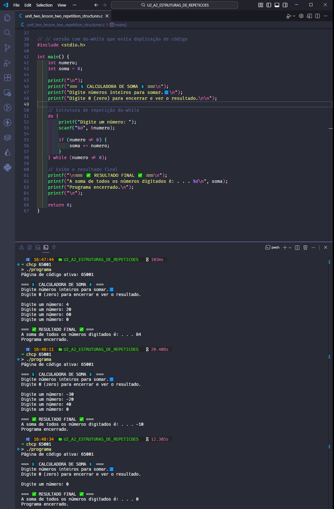

  <p align="center">
    
  </p>

# Projeto - Atividade Prática: Estruturas de Repetição While em C

## Disciplina: Algoritmos e Programação Estruturada

### Unidade 2 – Aula 2

Ministrado por _Dr. Gilberto Fernandes Junior_.

<br>

Abaixo segue o resultado do projeto concluído:

<br>

> 🎯 Objetivo da Atividade:
>
> - Compreender o funcionamento da estrutura de repetição `while` em linguagem de programação **_[C](https://en.cppreference.com/)_**.
> - Implementar um programa que utiliza laços de repetição para resolver problemas práticos.
> - Desenvolver habilidades no `controle de loops` baseados em condições.
> - Aprender a utilizar `valores sentinela` para encerramento de programas.

<br>

### 🧩 Features

- Leitura contínua de números inteiros via entrada do usuário.
- Implementação de estrutura de repetição while com condição de parada.
- Cálculo acumulativo de soma em tempo real.
- Utilização do número zero como valor sentinela.
- Interface interativa com feedback imediato.
- Exibição do resultado final após encerramento.

---

<table align="center">
  <tr>
    <td align="center">
      <a href="./images/result_activity_1.png">
        
      </a>
    </td>
    <td align="center">
      <a href="./images/result_activity_2.png">
        
      </a>
    </td>
  </tr>  
</table>

---

### 📚 Pré-requisitos

- [ ] Antes de iniciar este projeto, você deve ter conhecimento básico nas seguintes áreas:

- **Linguagem C Básica:** Sintaxe, estrutura main, variáveis e tipos de dados.
- **Entrada / Saída:** Comandos printf e scanf para interação com usuário.
- **Estruturas Condicionais:** Compreensão de if-else para lógica básica.
- **Operadores Relacionais:** Uso de operadores como != (diferente).
- **OnlineGDB:** Familiaridade com a plataforma online.

---

### 🛠️ Tecnologias Utilizadas

A Atividade foi desenvolvida utilizando:

[](https://en.cppreference.com/w/c/language)&nbsp;&nbsp;&nbsp;&nbsp;&nbsp;&nbsp;[](https://www.onlinegdb.com/)&nbsp;&nbsp;&nbsp;&nbsp;&nbsp;&nbsp;[](https://gcc.gnu.org/)&nbsp;&nbsp;&nbsp;&nbsp;&nbsp;&nbsp;[](https://code.visualstudio.com/)

---

### 📂 Estrutura do Projeto

```bash
U2_A2_ESTRUTURAS_DE_REPETICOES/
├── images/
│   ├── result_activity_1.png
│   └── result_activity_2.png
├── src/
│   ├── programa.exe
│   └── unit_two_lesson_two_repetition_structures.c       # Código principal da atividade
├── ATIVIDADE_PRATICA_U2_A2_ESTRUTURAS_REPETICAO.pdf
├── README.md                           # Este arquivo
└── roteiro_U2_A2_ESTRUTURAS_DE_REPETICOES.pdf
```

---

### ⚙️ Configuração e Execução

- [ ] &nbsp;&nbsp;&nbsp;Pré-requisitos:

✔️ - Acesso ao OnlineGDB ou compilador C local.

<br>

- [x] &nbsp;&nbsp;&nbsp;Forma recomendada (conforme roteiro da disciplina) ➡ Acesse o OnlineGDB e siga os passos:

```c
// Passo 1: Acesse https://www.onlinegdb.com/
// Passo 2: Selecione "C" como linguagem
// Passo 3: Implemente o código de soma com while:

#include <stdio.h>

int main() {
    int numero, soma = 0;

    printf("=== CALCULADORA DE SOMA ===\n");
    printf("Digite números inteiros para somar (0 para encerrar):\n");

    // Passo 4: Solicitar primeiro número
    printf("Digite um número: ");
    scanf("%d", &numero);

    // Passo 5: Implementar estrutura while
    while(numero != 0) {
        // Somar o número digitado
        soma += numero;

        // Solicitar próximo número
        printf("Digite outro número (0 para finalizar): ");
        scanf("%d", &numero);
    }

    // Passo 6: Exibir resultado final
    printf("\n=== RESULTADO ===\n");
    printf("A soma total dos números é: %d\n", soma);
    printf("Programa encerrado.\n");

    return 0;
}
```

---

### 🔬 Testes Realizados

✔️ - Validações do programa :

- [x] &nbsp;&nbsp;&nbsp;Leitura correta de números inteiros via scanf em loop.
- [x] &nbsp;&nbsp;&nbsp;Estrutura while funcionando com condição número != 0.
- [x] &nbsp;&nbsp;&nbsp;Cálculo acumulativo preciso da variável soma.
- [x] &nbsp;&nbsp;&nbsp;Encerramento correto ao digitar zero.
- [x] &nbsp;&nbsp;&nbsp;Exibição do resultado final formatado.
- [x] &nbsp;&nbsp;&nbsp;Teste com múltiplos conjuntos de números.
- [x] &nbsp;&nbsp;&nbsp;Verificação de soma com números positivos e negativos.

---

### 🧠 Habilidades Desenvolvidas

✔️ - Ao concluir esta atividade, você terá adquirido as seguintes habilidades e sub-habilidades :

- Implementação de estruturas de repetição while em C.
- Controle de loops baseados em condições de parada.
- Utilização de valores sentinela para encerramento de programas.
- Cálculos acumulativos com variáveis contadoras.
- Desenvolvimento de programas interativos com entrada contínua.
- Manipulação de variáveis para armazenamento de resultados.
- Habilidade em debug de loops infinitos e condições de parada.
- Capacidade de criar ferramentas de cálculo simples e eficientes.

---

### 📜 Licença

Por se tratar de um projeto de caráter exclusivamente acadêmico, desenvolvido como atividade prática da disciplina de Algoritmos e Programação Estruturada, ainda não foi atribuída uma licença formal.

O código tem finalidade educativa e de portfólio estudantil, sendo destinado apenas ao aprendizado e à avaliação no âmbito da faculdade. Caso deseje reutilizar ou adaptar o material para fins didáticos, sinta-se à vontade — apenas mantenha a referência ao autor original e ao contexto acadêmico.

---

<h4 align="center">
  👨‍💻 Desenvolvido por 
<h4/>
<br>

<table align="center">
  <tr>
    <td align="center">
      <a href="https://www.linkedin.com/in/edmar-radanovis/">
        <br>
        <sub><b>Edmar Radanovis</b></sub><br>
        <sub>Desenvolvedor Full Stack &nbsp;&</sub><br>
        <sub>Bacharelando em</sub><br>
        <sub>Engenharia de Software</sub>
      </a>
    </td>
    <td align="center">
      <a href="https://edwebdev.vercel.app/">
        <br>
        <sub><b>Ed Web Dev</b></sub><br>
      </a>
    </td>
  </tr>
</table>
<br>
<br>

[⬆ Voltar ao topo](#projeto---atividade-prática-estruturas-de-repetição-while-em-c)
