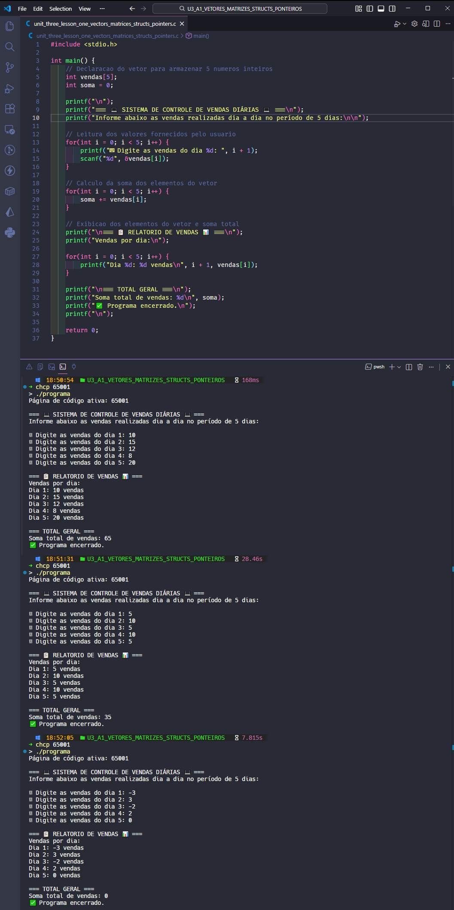

  <p align="center">
    
  </p>

# Projeto - Atividade Prática: Manipulação de Vetores em C

## Disciplina: Algoritmos e Programação Estruturada

### Unidade 3 – Aula 1

Ministrado por _Dr. Gilberto Fernandes Junior_.

<br>

Abaixo segue o resultado do projeto concluído:

<br>

> 🎯 Objetivo da Atividade:
>
> - Compreender a `declaração e manipulação` de vetores na linguagem de programação **_[C](https://en.cppreference.com/)_**.
> - Implementar um programa que faça a `leitura` , `cálculo` e `exibição` de elementos de um vetor.
> - Desenvolver habilidades no `armazenamento` e `processamento` de dados em arrays.
> - Aplicar vetores para resolver problemas práticos de `análise de dados`.

<br>

### 🧩 Features

- Declaração e inicialização de vetor de inteiros com tamanho 5.
- Leitura interativa de valores do usuário para preenchimento do vetor.
- Cálculo da soma total dos elementos armazenados.
- Exibição organizada dos valores individuais e resultado final.
- Simulação de sistema de análise de vendas diárias.
- Interface clara e amigável para interação com usuário.

---

<table align="center">
  <tr>
    <td align="center">
      <a href="./images/result_activity_1.png">
        
      </a>
    </td>
  </tr>  
</table>

---

### 📚 Pré-requisitos

- [ ] Antes de iniciar este projeto, você deve ter conhecimento básico nas seguintes áreas:

- **Linguagem C Básica:** Sintaxe, estrutura main, variáveis e tipos de dados.
- **Entrada / Saída:** Comandos printf e scanf para interação com usuário.
- **Estruturas de Controle:** Compreensão de loops for para iteração.
- **Operadores Aritméticos:** Uso de operadores para cálculos matemáticos.
- **OnlineGDB:** Familiaridade com a plataforma online.

---

### 🛠️ Tecnologias Utilizadas

A Atividade foi desenvolvida utilizando:

[](https://en.cppreference.com/w/c/language)&nbsp;&nbsp;&nbsp;&nbsp;&nbsp;&nbsp;[](https://www.onlinegdb.com/)&nbsp;&nbsp;&nbsp;&nbsp;&nbsp;&nbsp;[](https://gcc.gnu.org/)&nbsp;&nbsp;&nbsp;&nbsp;&nbsp;&nbsp;[](https://code.visualstudio.com/)

---

### 📂 Estrutura do Projeto

```bash
U3_A1_VETORES_MATRIZES_STRUCTS_PONTEIROS/
├── images/
│   ├── result_activity_1.png
├── src/
│   ├── programa.exe
│   └── unit_three_lesson_one_vectors_matrices_structs_pointers.c   # Código principal da atividade
├── ATIVIDADE_PRATICA_U3_A1_VETORES_MATRIZES_STRUCTS_PONTEIROS.pdf
├── README.md                                                       # Este arquivo
└── roteiro_U3_A1_VETORES_MATRIZES_STRUCTS_PONTEIROS.pdf
```

---

### ⚙️ Configuração e Execução

- [ ] &nbsp;&nbsp;&nbsp;Pré-requisitos:

✔️ - Acesso ao OnlineGDB ou compilador C local.

<br>

- [x] &nbsp;&nbsp;&nbsp;Forma recomendada (conforme roteiro da disciplina) ➡ Acesse o OnlineGDB e siga os passos:

```c
// Passo 1: Acesse https://www.onlinegdb.com/
// Passo 2: Selecione "C" como linguagem
// Passo 3: Implemente o código de manipulação de vetores:

#include <stdio.h>

int main() {
    // Passo 4: Declarar vetor de 5 elementos
    int vendas[5];
    int soma = 0;

    printf("=== SISTEMA DE ANÁLISE DE VENDAS ===\n");
    printf("Digite a quantidade de vendas para cada um dos 5 dias:\n");

    // Passo 5: Ler valores para o vetor
    for(int i = 0; i < 5; i++) {
        printf("Vendas do dia %d: ", i + 1);
        scanf("%d", &vendas[i]);
    }

    // Passo 6: Calcular soma total
    for(int i = 0; i < 5; i++) {
        soma += vendas[i];
    }

    // Passo 7: Exibir resultados
    printf("\n=== RELATÓRIO DE VENDAS ===\n");
    printf("Vendas por dia:\n");

    for(int i = 0; i < 5; i++) {
        printf("Dia %d: %d vendas\n", i + 1, vendas[i]);
    }

    printf("\nTotal de vendas no período: %d\n", soma);
    printf("Análise concluída!\n");

    return 0;
}
```

---

### 🔬 Testes Realizados

✔️ - Validações do programa :

- [x] &nbsp;&nbsp;&nbsp;Declaração correta do vetor com 5 posições.
- [x] &nbsp;&nbsp;&nbsp;Leitura adequada de valores via scanf em loop.
- [x] &nbsp;&nbsp;&nbsp;Armazenamento preciso nos índices do vetor.
- [x] &nbsp;&nbsp;&nbsp;Cálculo correto da soma total dos elementos.
- [x] &nbsp;&nbsp;&nbsp;Exibição organizada dos valores individuais.
- [x] &nbsp;&nbsp;&nbsp;Teste com diferentes conjuntos de números.
- [x] &nbsp;&nbsp;&nbsp;Funcionamento com números positivos e zero.

---

### 🧠 Habilidades Desenvolvidas

✔️ - Ao concluir esta atividade, você terá adquirido as seguintes habilidades e sub-habilidades :

- Declaração e manipulação de vetores unidimensionais em C.
- Utilização de loops for para percorrer e processar arrays.
- Armazenamento e recuperação de dados em estruturas indexadas.
- Cálculos matemáticos sobre conjuntos de dados armazenados.
- Desenvolvimento de sistemas simples de análise de dados.
- Implementação de interfaces interativas para entrada de dados.
- Organização e exibição clara de resultados processados.
- Aplicação prática de vetores em cenários reais de programação.

---

### 📜 Licença

Por se tratar de um projeto de caráter exclusivamente acadêmico, desenvolvido como atividade prática da disciplina de Algoritmos e Programação Estruturada, ainda não foi atribuída uma licença formal.

O código tem finalidade educativa e de portfólio estudantil, sendo destinado apenas ao aprendizado e à avaliação no âmbito da faculdade. Caso deseje reutilizar ou adaptar o material para fins didáticos, sinta-se à vontade — apenas mantenha a referência ao autor original e ao contexto acadêmico.

---

<h4 align="center">
  👨‍💻 Desenvolvido por 
<h4/>
<br>

<table align="center">
  <tr>
    <td align="center">
      <a href="https://www.linkedin.com/in/edmar-radanovis/">
        <br>
        <sub><b>Edmar Radanovis</b></sub><br>
        <sub>Desenvolvedor Full Stack &nbsp;&</sub><br>
        <sub>Bacharelando em</sub><br>
        <sub>Engenharia de Software</sub>
      </a>
    </td>
    <td align="center">
      <a href="https://edwebdev.vercel.app/">
        <br>
        <sub><b>Ed Web Dev</b></sub><br>
      </a>
    </td>
  </tr>
</table>
<br>
<br>

[⬆ Voltar ao topo](#projeto---atividade-prática-manipulação-de-vetores-em-c)
