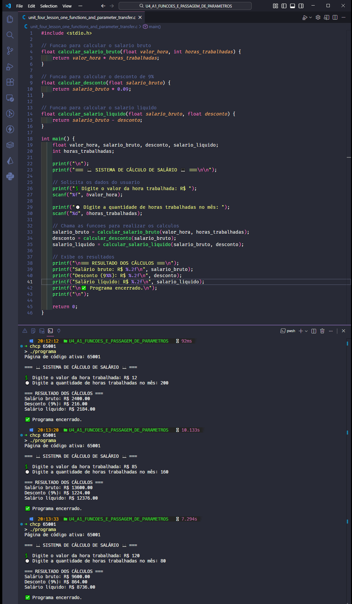

  <p align="center">
    
  </p>

# Projeto - Atividade Prática: Funções e Passagem de Parâmetros em C

## Disciplina: Algoritmos e Programação Estruturada

### Unidade 4 – Aula 1

Ministrado por _Dr. Gilberto Fernandes Junior_.

<br>

Abaixo segue o resultado do projeto concluído:

<br>

> 🎯 Objetivo da Atividade:
>
> - Compreender o conceito de `funções` e sua aplicação na `modularização` de programas em linguagem **_[C](https://en.cppreference.com/)_**.
> - Implementar funções que realizam `cálculos financeiros` com base em parâmetros fornecidos pelo usuário.
> - Desenvolver habilidades na `criação` e `chamada` de funções com parâmetros e retorno de valores.
> - Aplicar `modularização` para organizar cálculos complexos em partes menores e reutilizáveis.

<br>

### 🧩 Features

- Implementação de três funções especializadas para cálculos financeiros.
- Cálculo de salário bruto baseado em horas trabalhadas e valor por hora.
- Aplicação de desconto de 9% sobre o salário bruto.
- Cálculo do salário líquido após descontos.
- Interface interativa para entrada de dados do usuário.
- Exibição organizada dos resultados financeiros.
- Sistema modular para fácil manutenção e expansão.

---

<table align="center">
  <tr>
    <td align="center">
      <a href="./images/result_activity_1.png">
        
      </a>
    </td>
  </tr>  
</table>

---

### 📚 Pré-requisitos

- [ ] Antes de iniciar este projeto, você deve ter conhecimento básico nas seguintes áreas:

- **Linguagem C Básica:** Sintaxe, estrutura main, variáveis e tipos de dados.
- **Entrada / Saída:** Comandos printf e scanf para interação com usuário.
- **Operadores Aritméticos:** Multiplicação, porcentagem e subtração.
- **Conceitos de Funções:** Noções básicas de criação e chamada de funções.
- **OnlineGDB:** Familiaridade com a plataforma online.

---

### 🛠️ Tecnologias Utilizadas

A Atividade foi desenvolvida utilizando:

[](https://en.cppreference.com/w/c/language)&nbsp;&nbsp;&nbsp;&nbsp;&nbsp;&nbsp;[](https://www.onlinegdb.com/)&nbsp;&nbsp;&nbsp;&nbsp;&nbsp;&nbsp;[](https://gcc.gnu.org/)&nbsp;&nbsp;&nbsp;&nbsp;&nbsp;&nbsp;[](https://code.visualstudio.com/)

---

### 📂 Estrutura do Projeto

```bash
U4_A1_FUNCOES_E_PASSAGEM_DE_PARAMETROS/
├── images/
│   ├── result_activity_1.png
├── src/
│   ├── programa.exe
│   └── unit_four_lesson_one_functions_and_parameter_transfer.c   # Código principal da atividade
├── ATIVIDADE_PRATICA_U4_A1_FUNCOES_E_PASSAGEM_DE_PARAMETROS.pdf
├── README.md                                                     # Este arquivo
└── roteiro_U4_A1_FUNCOES_E_PASSAGEM_DE_PARAMETROS.pdf
```

---

### ⚙️ Configuração e Execução

- [ ] &nbsp;&nbsp;&nbsp;Pré-requisitos:

✔️ - Acesso ao OnlineGDB ou compilador C local.

<br>

- [x] &nbsp;&nbsp;&nbsp;Forma recomendada (conforme roteiro da disciplina) ➡ Acesse o OnlineGDB e siga os passos:

```c
// Passo 1: Acesse https://www.onlinegdb.com/
// Passo 2: Selecione "C" como linguagem
// Passo 3: Implemente o código com funções:

#include <stdio.h>

// Passo 4: Declarar protótipos das funções
float calcular_salario_bruto(float valor_hora, int horas_trabalhadas);
float calcular_desconto(float salario_bruto);
float calcular_salario_liquido(float salario_bruto, float desconto);

int main() {
    float valor_hora, salario_bruto, desconto, salario_liquido;
    int horas_trabalhadas;

    printf("=== SISTEMA DE CÁLCULO DE SALÁRIO ===\n");

    // Passo 5: Solicitar dados do usuário
    printf("Digite o valor da hora de trabalho: R$ ");
    scanf("%f", &valor_hora);

    printf("Digite a quantidade de horas trabalhadas no mês: ");
    scanf("%d", &horas_trabalhadas);

    // Passo 6: Chamar as funções
    salario_bruto = calcular_salario_bruto(valor_hora, horas_trabalhadas);
    desconto = calcular_desconto(salario_bruto);
    salario_liquido = calcular_salario_liquido(salario_bruto, desconto);

    // Passo 7: Exibir resultados
    printf("\n=== EXTRATO DE PAGAMENTO ===\n");
    printf("Salário Bruto: R$ %.2f\n", salario_bruto);
    printf("Desconto (9%%): R$ %.2f\n", desconto);
    printf("Salário Líquido: R$ %.2f\n", salario_liquido);

    return 0;
}

// Implementação das funções
float calcular_salario_bruto(float valor_hora, int horas_trabalhadas) {
    return valor_hora * horas_trabalhadas;
}

float calcular_desconto(float salario_bruto) {
    return salario_bruto * 0.09; // 9% de desconto
}

float calcular_salario_liquido(float salario_bruto, float desconto) {
    return salario_bruto - desconto;
}
```

---

### 🔬 Testes Realizados

✔️ - Validações do programa :

- [x] &nbsp;&nbsp;&nbsp;Implementação correta das três funções especializadas.
- [x] &nbsp;&nbsp;&nbsp;Cálculo preciso do salário bruto (horas × valor hora).
- [x] &nbsp;&nbsp;&nbsp;Aplicação correta do desconto de 9%.
- [x] &nbsp;&nbsp;&nbsp;Cálculo exato do salário líquido.
- [x] &nbsp;&nbsp;&nbsp;Passagem adequada de parâmetros entre funções.
- [x] &nbsp;&nbsp;&nbsp;Exibição formatada dos resultados financeiros.
- [x] &nbsp;&nbsp;&nbsp;Teste com diferentes valores de entrada.

---

### 🧠 Habilidades Desenvolvidas

✔️ - Ao concluir esta atividade, você terá adquirido as seguintes habilidades e sub-habilidades :

- Criação e implementação de funções em linguagem C.
- Passagem de parâmetros e retorno de valores em funções.
- Modularização de programas complexos em partes menores.
- Implementação de cálculos financeiros com precisão.
- Organização de código através de protótipos de funções.
- Desenvolvimento de sistemas de cálculo salarial.
- Aplicação de porcentagens em cálculos financeiros.
- Criação de interfaces interativas para entrada de dados.

---

### 📜 Licença

Por se tratar de um projeto de caráter exclusivamente acadêmico, desenvolvido como atividade prática da disciplina de Algoritmos e Programação Estruturada, ainda não foi atribuída uma licença formal.

O código tem finalidade educativa e de portfólio estudantil, sendo destinado apenas ao aprendizado e à avaliação no âmbito da faculdade. Caso deseje reutilizar ou adaptar o material para fins didáticos, sinta-se à vontade — apenas mantenha a referência ao autor original e ao contexto acadêmico.

---

<h4 align="center">
  👨‍💻 Desenvolvido por 
<h4/>
<br>

<table align="center">
  <tr>
    <td align="center">
      <a href="https://www.linkedin.com/in/edmar-radanovis/">
        <br>
        <sub><b>Edmar Radanovis</b></sub><br>
        <sub>Desenvolvedor Full Stack &nbsp;&</sub><br>
        <sub>Bacharelando em</sub><br>
        <sub>Engenharia de Software</sub>
      </a>
    </td>
    <td align="center">
      <a href="https://edwebdev.vercel.app/">
        <br>
        <sub><b>Ed Web Dev</b></sub><br>
      </a>
    </td>
  </tr>
</table>
<br>
<br>

[⬆ Voltar ao topo](#projeto---atividade-prática-funções-e-passagem-de-parâmetros-em-c)
